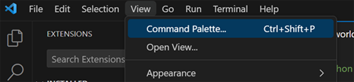
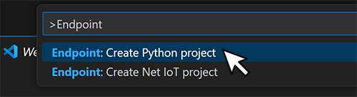
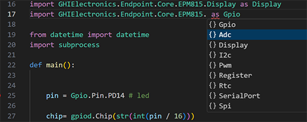

# Beyond .NET

---

Endpoint's hardware and documentation's main focus is .NET, however the system is capable of supporting other languages as well. 

---

# Python

## Getting Started

Install the latest version VS Code, https://code.visualstudio.com/

Visit the extension section from within VS Code and search for and install `Endpoint VSC Python Debugger`. Alternatively, [Download](downloads.md) and install the latest Endpoint VSC Python Extension (.vsix) file manually.

 Navigate to `View -> Command Palette`

 

 Search for **Endpoint** and select `Endpoint:Create Python project`

 

 Give the project a name and location.

> [!Tip]
> If you change the default project name you must also change it in the **settings.json** file

## Python Libraries

Endpoint uses the standard Python libraries when available. When a library doesn't existing inside the Python API relating to embedded hardware we use an Endpoint library to fill in the missing gaps. Additional libraries are under development. 
 
|                 |                                                |
|-----------------|------------------------------------------------|
| **Peripheral**  | **Endpoint Python Library**                    |
|                 |                                                |
| **GPIO**        | GHIElectronics.Endpoint.Core.EPM815.Gpio       |
| **PWM**         | GHIElectronics.Endpoint.Core.EPM815.PWM        | 
| **SPI**         | GHIElectronics.Endpoint.Core.EPM815.Spi        | 
| **I2C**         | GHIElectronics.Endpoint.Core.EPM815.Adc        | 
| **ADC**         | GHIElectronics.Endpoint.Core.EPM815.Adc        | 
| **DISPLAY**     | GHIElectronics.Endpoint.Core.EPM815.Display    | 
| **RTC**         | GHIElectronics.Endpoint.Core.EPM815.RTC        |
| **Register**    | GHIElectronics.Endpoint.Core.EPM815.Register   | 
| **Serial Port** | GHIElectronics.Endpoint.Core.EPM815.SerialPort | 

The Python libraries are built into the release image, user don't need to do anything else, just use **import**.

This uses remote debug, so there is no IntelliSense built in. Optionally users can install on the PC to use IntelliSense when importing the libraries. 

```cs
C:\pip install GHIElectronics.Endpoint.Core
```

After install, VSC code IntelliSense will show the libraries available.  

 

---
## Python Code Samples

Here is a couple code samples to get started. 

Additional code samples can be found in the [Endpoint Samples Repo 
](https://github.com/ghi-electronics/endpoint-samples) 


### Python GPIO

The code sample below blinks an on-board LED.

```python
import gpiod
import time
import GHIElectronics.Endpoint.Core.EPM815.Gpio as Gpio
 
pin = Gpio.Pin.PC0 
chip=gpiod.Chip(str(int(pin / 16)))
line = chip.get_line(pin % 16)
line.request(consumer='test', type=gpiod.LINE_REQ_DIR_OUT)
 
while True:
    line.set_value(1)
    time.sleep(0.5)
    line.set_value(0)
    time.sleep(0.5)
```

### Python PWM

The code sample demonstrates PWM using an on-board buzzer.

```python
import time
import GHIElectronics.Endpoint.Core.EPM815.G as Pwm

pwm = Pwm.PwmController(Pwm.Pin.PF9)

pwm.Frequency = 1000
pwm.DutyCycle = 0.5
pwm.Start()
time.sleep(3)
pwm.Stop()
```

---


 

 