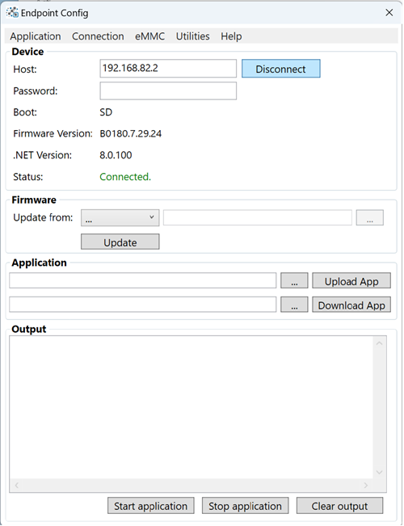
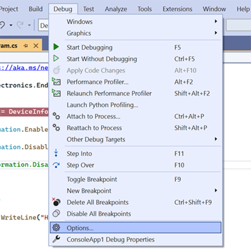

# Configuration
---

## Endpoint Config Tool 

The Endpoint Config tool is used to update & configure Endpoint Hardware. It will also give us information about our device. 

[**Download**](downloads.md)
 and install the latest version to begin. 

  

#### Connecting to the Device

Connect the Endpoint device to the PC using a USB cable. Once the booting sequence is complete,the USER LED will be fully lit. Press **Connect** on the Config tool app. The tool will display device information once connected

 

 #### Setting up a Device Password

 Creating a device password is optional. To create a password for the device, select Security -> Change Password. 

  

  After selecting a window will appear to enter our a new password and verify it's correct. 

   

> [!Tip] 
> We can remove an existing password from a device by leaving the fields blank and clicking OK 

   After creating or changing a password, the device will disconnect. To reconnect we will need to add the password we created. 
   
   Once the correct password is entered, Endpoint Config on the users machine will save the password in the box. Meaning you don't have to enter it every time you use the tool. If you move the device to another computer you'll need to enter the password to connect. 
  

  > [!Note] 
  > There is no way to retrieve a forgotten password, the device must be completely erased and an new image created. 

 We also need to set up the programming IDE with our new password. 

  Create or open an existing .NET project and navigate to 

  **Debug -> Options**

  

  Select Endpoint Debugger and highlight the SSH connection and click **Edit**

  Add the newly created password and click **OK**. 

  

 

