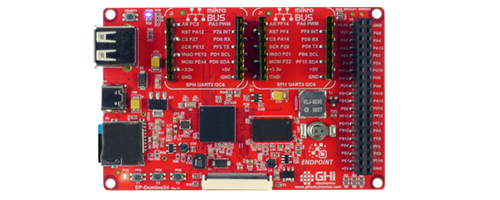

# Endpoint Single Board Computers

---

## Endpoint Domino 

The Endpoint Domino provides an easy prototyping and evaluating board option, that is low-cost and user friendly. 

### Features:
* Display connector
* 2x Mikro Bus headers
* USB Host
* User LED
* Buzzer
* 40 pin expansion header
* microSD card slot
* USB-C connector 

---