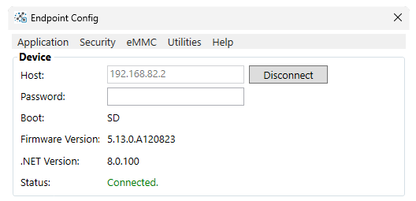
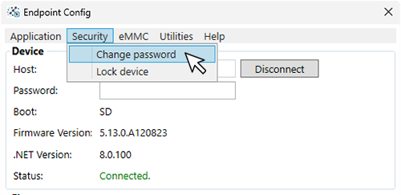

# Getting Started

---

 ## Endpoint for Visual Studio
 With Endpoint you can deploy and debug using Visual Studio. Even the free community version. 

 #### Install Visual Studio
 If you don't already have the latest version of Visual Studio, download it here:
 https://visualstudio.microsoft.com/downloads/

 #### Visual Studio Extension file 

 [**Download**](downloads.md) and install the latest Endpoint Visual Studio Extension (.vsix) file

 #### Endpoint Debugger

 After installing the .vsix file, create a new .NET 8 application. By default the .NET application will run on the PC. We need to switch to run the program on the Endpoint device. 

 At the top of the Visual Studio menu navigate to:

 **Debug -> Options**

 

 From there navigate to the Endpoint Debugger option and make sure the box is check for root@192.168.82.2. If unchecked the application will only run on the PC. 

  

 #### NuGet Libraries

 Endpoint uses the standard .NET libraries when available. When a library doesn't existing inside the .NET API relating to embedded hardware we use an Endpoint library to fill in the missing gaps. 
 
 It is preferred to access NuGet libraries through NuGet.org by using Visual Studio's default package source. 

 The Endpoint libraries are provided [**here**](downloads.md) in case you're having trouble with the online source or need an older or pre-release library that's not hosted on NuGet.

 Learn more about the Endpoint API [**here**](api/intro.md). 

 ---

 ## Endpoint for VS Code

 Endpoint also works using the VS Code IDE. 
 
 #### Install VS Code
 
 If you don't already have the latest version, download it here:

 https://code.visualstudio.com/

 #### VS Code Extension file 

 [**Download**](downloads.md) and install the latest Endpoint VS Code Extension (.vsix) file

 

 Navigate to:
 
 **View -> Command Palette**

 

 Search **Endpoint** and select:
 
 **Endpoint:Create Net IoT project** 

  

 ---

 ## Endpoint OS

 The Endpoint OS can be hosted on an microSD card or inside hardware's eMMC when available. 

 #### Creating the OS image

 Use your preferred disk imaging software to create a disk image on a blank microSD card. We recommend something like Win32 Disk Imager.

 Find the latest Endpoint disk image [**here**](downloads.md) and burn it to the blank microSD card. 

 

 #### Boot from SD

 Once the image file is burned to the microSD card the OS is ready to boot. Insert the card into the microSD card slot of your hardware and connect the device to the PC. 

 > [!Note] 
 > When using Endpoint Domino SD boot mode is the default boot mode. If you're using the Development board there is a button to put the device in SD boot mode. 

Once the USER LED lights the board has successfully loaded the Endpoint OS from the microSD.

 ---

## Endpoint Config tool. 

The Endpoint Config tool is used to update & configure Endpoint Hardware. It will also give us information about our device. 

[**Download**](downloads.md)
 and install the latest version to begin. 

  

#### Connecting to the Device

Connect the Endpoint device to the PC using a USB cable. Once the booting sequence is complete,the USER LED will be fully lit. Press **Connect** on the Config tool app. The tool will display device information once connected

 

 #### Setting up a Device Password

 Creating a device password is optional. To create a password for the device, select Security -> Change Password. 

  

  After selecting a window will appear to enter our a new password and verify it's correct. 

   

> [!Tip] 
> We can remove an existing password from a device by leaving the fields blank and clicking OK 

   After creating or changing a password, the device will disconnect. To reconnect we will need to add the password we created. 
   
   Once the correct password is entered, Endpoint Config on the users machine will save the password in the box. Meaning you don't have to enter it every time you use the tool. If you move the device to another computer you'll need to enter the password to connect. 

  

  > [!Note] 
  > There is no way to retrieve a forgotten password, the device must be completely erased and an new image created. 

 We also need to set up the programming IDE with our new password. 

  Create or open an existing .NET project and navigate to 

  **Debug -> Options**

  

  Select Endpoint Debugger and highlight the SSH connection and click **Edit**

  Add the newly created password and click **OK**. 

  

 ---