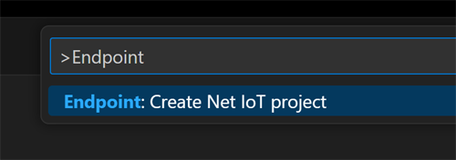

# Getting Started

---

Endpoint allows for remote deploy and debug of .NET C# (and VB)applications using either Microsoft Visual Studio or Microsoft VS Code.

---

 ## Endpoint for Visual Studio
 With Endpoint you can deploy and debug using Visual Studio. Even the free community version. 

 #### Install Visual Studio
 If you don't already have the latest version of Visual Studio, download it here:
 https://visualstudio.microsoft.com/downloads/

 #### Visual Studio Extension (.visx)

 Download and install the newest Endpoint Visual Studio Project System by going to Extensions > Manage Extensions. In the Manage Extensions dialog box select Online in the left panel. Type 'endpoint' into the Search text box in the upper right of the window to search for and install the Endpoint Project System. You'll need to restart Visual Studio to let the extension installer complete the installation.

Alternately you can download the Visual Studio Project System from our  [**Download**](downloads.md) and install the latest Endpoint Visual Studio Extension (.vsix) file page and open or double click on the file to install the extension.

 #### Endpoint Debugger

 After installing the .vsix file, create a new .NET 8 application. By default the .NET application will run on the PC. We need to switch to run the program on the Endpoint device. 

 At the top of the Visual Studio menu navigate to:

 **Debug -> Options**

 

 From there navigate to the Endpoint Debugger option and make sure the box is check for root@192.168.82.2. If unchecked the application will only run on the PC. 

  

 #### NuGet Libraries

 Endpoint uses the standard .NET libraries when available. When a library doesn't existing inside the .NET API relating to embedded hardware we use an Endpoint library to fill in the missing gaps. 
 
 It is preferred to access NuGet libraries through NuGet.org by using Visual Studio's default package source. 

 The Endpoint libraries are provided [**here**](downloads.md) in case you're having trouble with the online source or need an older or pre-release library that's not hosted on NuGet.

 Learn more about the Endpoint API [**here**](api/intro.md). 

 ---

 ## Endpoint for VS Code

 Endpoint also works using the VS Code IDE. 
 
> [!Note]
 > VS Code support is not public yet. Use Visual Studio instead.

 #### Install VS Code
 
 If you don't already have the latest version, download it here:

 https://code.visualstudio.com/

 #### VS Code Extension file 

 [**Download**](downloads.md) and install the latest Endpoint VS Code Extension (.vsix) file

 

 Navigate to:
 
 **View -> Command Palette**

 

 Search **Endpoint** and select:
 
 **Endpoint:Create Net IoT project** 

  

 ---

 ## Endpoint OS

 The Endpoint OS can be hosted on an microSD card or inside hardware's eMMC when available. 

 #### Creating the OS image

 Use your preferred disk imaging software to create a disk image on a blank microSD card. We recommend something like Win32 Disk Imager.

 Find the latest Endpoint disk image [**here**](downloads.md) and burn it to the blank microSD card. 

 

 #### Boot from SD

 Once the image file is burned to the microSD card the OS is ready to boot. Insert the card into the microSD card slot of your hardware and connect the device to the PC. 

 > [!Note] 
 > When using Endpoint Domino SD boot mode is the default boot mode. If you're using the Development board there is a button to put the device in SD boot mode. 

Once the USER LED lights the board has successfully loaded the Endpoint OS from the microSD.

 ---
