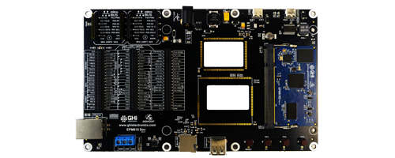

# Endpoint
---
The Endpoint line of products provides an easy way to use FULL .NET 8 on a embedded device using Visual Studio or VS Code.

---
## Single Board Computer

The Endpoint Domino provides the lowest barrier of entry to the world of Endpoint and .NET 8 on hardware   [**Learn More...**](sbc.md)

---

## System on Modules

Available as surface mount modules and a 200 pin SO-DIMM module.   [**Learn More...**](som.md) 

---
## Development Boards
 

Get started quickly with an Endpoint development board -- you'll be programming FULL .NET 8 on hardware in minutes!   [**Learn More...**](dev.md) 

---

You can also visit our main website at [**main website**](http://www.ghielectronics.com) and our  [**community forum**](https://forums.ghielectronics.com/).