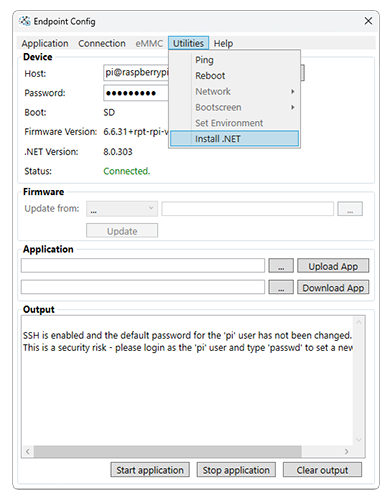

# Other Platforms

Endpoint's Visual Studio extension and [config tool](~/endpoint/configuration.md) support other Linux SBCs from companies such as Raspberry Pi and BeagleBoard. This gives developers an easy way to test out the power of .NET on hardware they may already own.

Full remote network deploying and debugging are supported. 

## Getting Started

The main [Getting Started](../getting-started.md) page applies the official Endpoint devices. 

Other Linux boards require some additional steps for the [Endpoint Config](../configuration.md) tool to work, as shown later on this page. Once enabled, use the tool to install .NET onto the device.



From this point, the Endpoint Extension can be used, just remember to set the SSH log-in info appropriately. More info are found on the main [Getting Started](../getting-started.md) page.

## Raspberry Pi
 
Raspberry Pi may have SSH disable by default, make sure SSH is enabled for connection. Visit the Raspberry Pi website for details on enabling SSH. 
 
> [!Tip] 
> If the IP address is not known, [config tool](../configuration.md) accepts default username(pi@raspberrypi) and password(raspberry)
 
## BeagleBone

On BeagleBone, NOPASSWD needs to be enabled for sudo command. To enable NOPASSWD, run the command below from PC's command line:
 
```
ssh debian@beaglebone
```
 
Enter password if needed. Once SSH is connected, run the second command below:
 
```
sudo bash -c 'echo "debian ALL=NOPASSWD: ALL" >> /etc/sudoers'
```

Please note that after running this command, the device may no longer ask password for sudo mode that reduces your BeagleBone security. 

> [!Tip] 
> If the IP address is not known, [config tool](../configuration.md) accepts default username(debian@beaglebone) and password(temppwd)

## Supported Features
Devices running .NET may support only some of the IoT features. This table compares features on some popular boards compared to Endpoint Domino.
 
 
Features				| Endpoint	|  Raspberry	| BeagleBone
 --- 					| ---		| ---			| ---
GPIO					|	✓		| ✓				|✓
PWM						|	✓		| ✓				|✓
SPI						|	✓		| ✓				|✓
I2C						|	✓		| ✓				|✓
UART					|	✓		| ✓				|✓
UART					|	✓		| ✓				|✓
CAN						|	✓		| ✗				|✗
ADC						|	✓		| ✗				|✗
Digital Signal			|	✓		| ✗				|✗
RTC						|	✓		| ✗				|✗
USB						|	✓		| ✗				|✗
SD						|	✓		| ✗				|✗
Parallel Display		|	✓		| ✗				|✗
IFU						|	✓		| ✗				|✗
Watchdog				|	✓		| ✗				|✗
Camera					|	✓		| ✗				|✗

## Boot time

Endpoint devices are designed with a tighter image for faster boot. This is a typical boot time, from power up to a complete boot with a blink LED in .NET.

 Device 			| Typical boot time 
 --- 				| ---
 Endpoint Domino 	| 6 seconds
 Raspberry Pi 4 	| 30 seconds
 BeagleBone Black 	| 50 seconds

> [!Tip] 
> Consider boot-time when following the getting started instructions.

