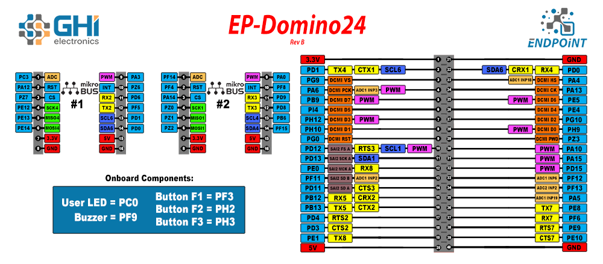

# Endpoint Single Board Computers

---

## Endpoint Domino 

The Endpoint Domino provides an easy prototyping and evaluating board option, that is low-cost and user friendly. 

### Features:
* Display connector
* 2x Mikro Bus headers
* USB Host
* User LED
* Buzzer
* 40 pin expansion header
* microSD card slot
* USB-C connector 

## Display
The display FPC connector uses a common pinout available on many displays. Some of these displays include capacitive touch screens, which are supported as well.

Here is a list of displays we have tested from www.buydisplay.com

Display | Type | Link
--|--|--
ER12344 | 4.8" 480x272 | [Link...](www.g.com)

See the example under `DisplayController` under `Endpoint API` for details on how to configure the system for the desired display.

## Camera

---