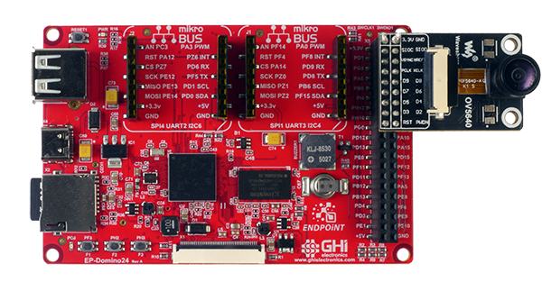

# Endpoint Single Board Computers

---

## Endpoint Domino 

The Endpoint Domino provides an easy prototyping and evaluating board option, that is low-cost and user friendly. 

#### Features:
* 32bit ARM 650Mhz, 512MB DDR3
* Display FPC connector
* 2x mikroBUS headers
* USB Host
* User LED
* Buzzer
* 40-pin expansion header
* microSD card slot
* USB-C connector 

---

## Pinout

---

## Displays

The display FPC connector on EP-Domino uses a common pinout available on many displays. Some of these displays include capacitive touch screens, which are supported as well.

Pin | Function
--|--
1 | Backlight Cathode (-)
2 | Backlight Anode (+)
3 | GND
4 | 3.3V
5-12 | Red Data (top 5 bits only)
13-20 | Green Data (top 6 bits only)
21-28 | Blue Data (top 5 bits only)
29 | GND
30 | Clock (PCLK)
31 | Enable (Connected to 3.3V)
32 | Horizontal Sync (HSYNC)
33 | Vertical Sync (VSYNC)
34 | Data Enable (DE)
35 | Not Connected
36 | GND
37 | Cap Touch Interrupt
38 | Cap Touch Reset
39 | Cap Touch SCL
40 | Cap Touch SDA

Here is a list of tested displays from www.buydisplay.com. If **Touch** is needed make sure the display is the 40 pin single cable version that includes touch on pins 37-40. 

Display | Type | Link
--|--|--
ER-TFT043-3 | 4.3" 480x272 | [Link...](https://www.buydisplay.com/tft-4-3-inch-lcd-module-touchscreen-display-for-mp4-gps-480x272)
ER-TFT043A3-3 | 4.3" 480x272 | [Link...](https://www.buydisplay.com/sunlight-readable-4-3-inch-high-brightness-480x272-tft-lcd-display)
ER-TFT043A1-7 | 4.3" 800x480 | [Link...](https://www.buydisplay.com/4-3-800x480-ips-tft-lcd-module-all-viewing-optl-touchscreen-display)
ER-TFT070A2-4 | 7" 800x480 no Touch support | [Link...](https://www.buydisplay.com/7-tft-lcd-touch-screen-display-module-800x480-for-mp4-gps-tablet-pc)

See the [Displays](../tutorials/displays.md) tutorial for coding examples.

---

## Cameras

The Endpoint OS supports cameras through USB and parallel. For added convenience, the top side of the 40 pin header is pinout compatible with the off-the-shelf OV5640 camera board.

See the [Camera](../tutorials/camera.md) tutorial for coding examples.

---

## mikroBUS

Endpoint Domino has 2x [mikroBUS](https://www.mikroe.com/mikrobus) headers compatible with over 1000 click modules. 

---

## Wi-Fi

A Wi-Fi dongle can be connected to the USB port to give the board a networking interface. See the [Networking](../tutorials/networking.md) tutorial for more details and coding examples.

> [!TIP]
> List of potential Wi-Fi dongles (reported by Users)

- [Netis WF2120](https://www.amazon.com/dp/B008O2AL0K?psc=1&ref=ppx_yo2ov_dt_b_product_details)
- [TP-Link TL-WN725N](https://www.amazon.com/gp/product/B008IFXQFU/ref=ox_sc_act_title_1?smid=ATVPDKIKX0DER&psc=1)
