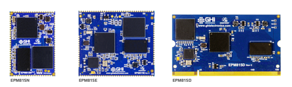

# Endpoint System on Modules
---
# COMING SOON!

The Endpoint SoMs provide a low cost way to add FULL .NET 8 computing power to any embedded product. They will be available in a 200 pin SO-DIMM format or as surface mount modules. 

---

You can visit our main website at [**www.ghielectronics.com**](http://www.ghielectronics.com) and our community forums at [**forums.ghielectronics.com**](https://forums.ghielectronics.com/).

## Module Pinouts

### EPM815N Pinout

### EPM815E Pinout

### EPM815D Pinout
