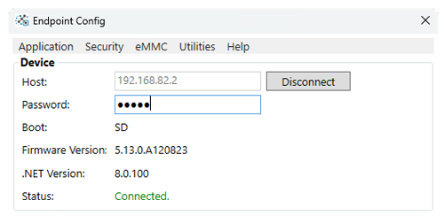

# Endpoint Introduction
---

Endpoint is FULL .NET 8 for circuits! Load and run applications on embedded hardware.

All you need to get started is Visual Studio or VS Code, an [Endpoint device](hardware/intro.md), and a USB cable.

---

## Getting Started

Get started quickly with Endpoint using .NET 8   [**Learn More...**](getting-started.md) 

---
## Devices

Endpoint hardware to fit all needs.   [**Learn more...**](hardware/intro.md)   

---
## Configuration

Endpoint Config tool easily connects and configures devices   [**Learn more...**](configuration.md)

---
## Libraries

Endpoint uses existing .NET hardware libraries when available. Some we had to create   [**Learn more...**](api/intro.md)

---

## Downloads

Visual Studio/VS Code and device downloads.   [**Learn more...**](downloads.md)

---
## Release Notes

Find the latest changes to Endpoint.   [**Learn more...**](release-notes.md) 

---
## Limitations

 

Endpoint limitations when using .NET   [**Learn more...**](limitations.md) 

---

You can also visit our main website at [**main website**](http://www.ghielectronics.com) and our  [**community forum**](https://forums.ghielectronics.com/).
