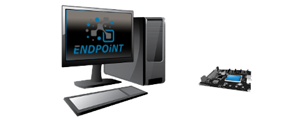

# Limitations
---

**There are none!**   But seriously, while full .NET 8 is supported there are some limitations specific to hardware. 

## .NET limitations:
Support for only .NET on arm32. 
User application is not protected. 
DCMI Camera limited to I2C6. 

## Still under development:
CDC is not supported  
Camera: OV5640 support  
WiFi: Only TL-WN725 support  
Hibernation is not supported  

