# Amazon Web Services
---
This example shows how to communicate with AWS using MQTT. This demo assumes the device has established a [Networking(networking.md) interface and the date and time on the device are set correctly.

> [!Tip]
> Needed NuGets: GHIElectronics.Endpoint.Core, GHIElectronics.Endpoint.Devices.Network, M2MqttDotnetCore

```
string iotEndpoint = "your iot endpoint"; 
Console.WriteLine("AWS IoT Dotnet message publisher starting..");

int brokerPort = 8883;
string topic = "$aws/things/EPDominoThing2024/shadow/update/documents";
string message = "Test message";

var caCertData = Resources.AmazonRootCA1; // load from resource
var caClientCertData = Resources.device_certificate; // this is pfx format load from resource

var caCert = new X509Certificate(caCertData);
var clientCert = new X509Certificate2(caClientCertData);


var client = new MqttClient(iotEndpoint, brokerPort, true, caCert, clientCert, MqttSslProtocols.TLSv1_2);

string clientId = Guid.NewGuid().ToString();
client.Connect(clientId);
Console.WriteLine($"Connected to AWS IoT with client id: {clientId}.");

client.Subscribe(new string[] { topic }, new byte[] { 0 });
client.MqttMsgPublishReceived += (a, b) =>
{
    Console.WriteLine(Encoding.UTF8.GetString(b.Message));
};

int i = 0;
while (true)
{
    client.Publish(topic, Encoding.UTF8.GetBytes($"{message} {i}"));
    Console.WriteLine($"Published: {message} {i}");
    i++;
    Thread.Sleep(5000);
}

```
We need a few things to complete the code sample that we'll get from AWS. We need an iotEndPoint, a deviceId, an AWS root certificate, a client certificate and a private key. First, you'll need to create an AWS account. 

Once you've created your account, we need to find the service to set up our device. On the AWS Management  Console, search for the service 'IoT Core' and select it. 

## Create Thing

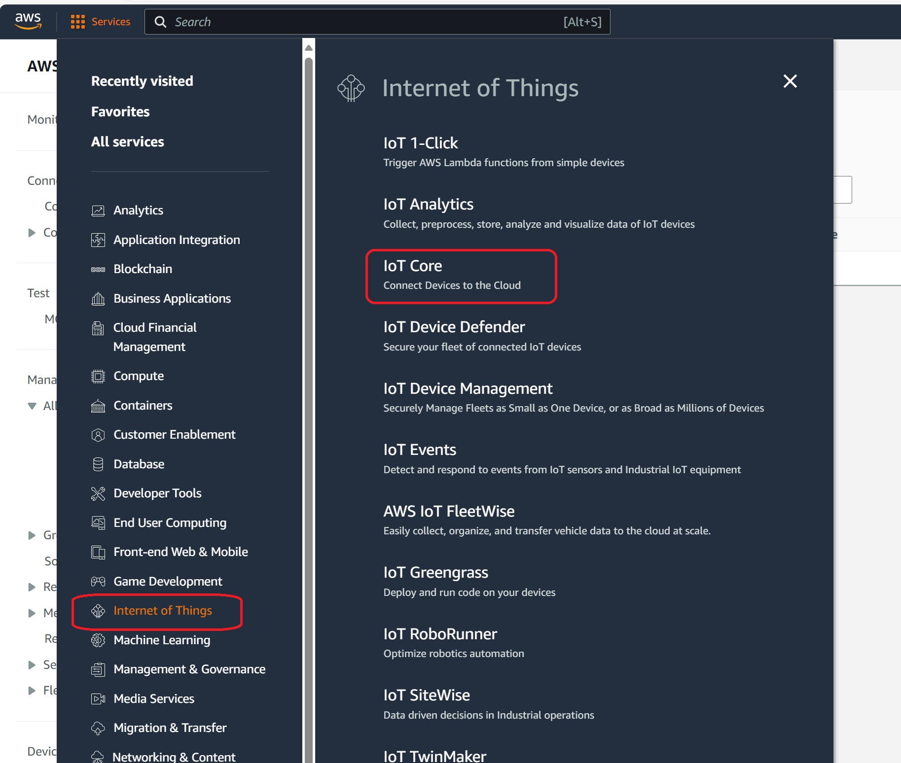

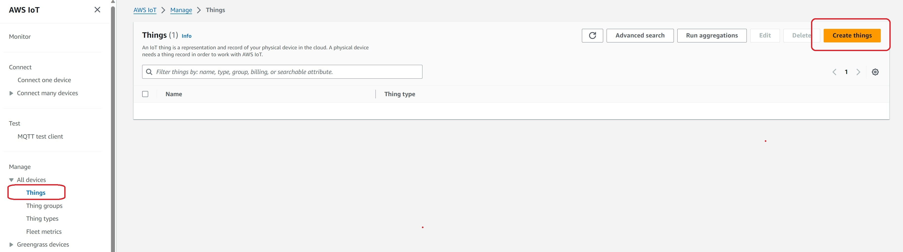

Select default and click next

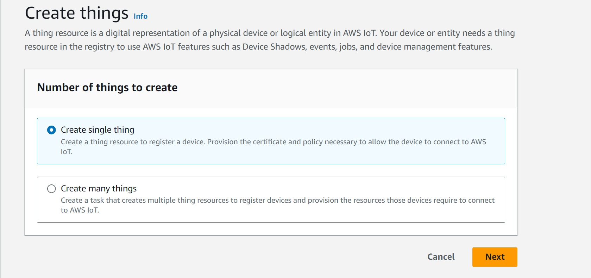

We created Thing name EPDomino24, thing type is optional.

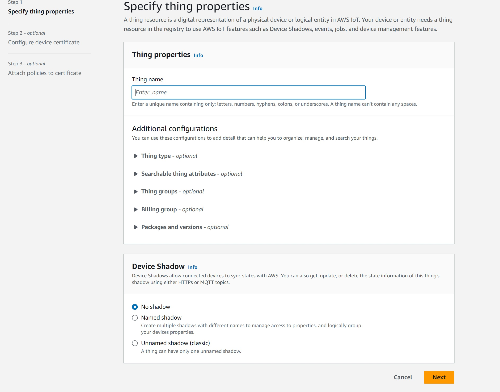

Select auto generate certificate and click next

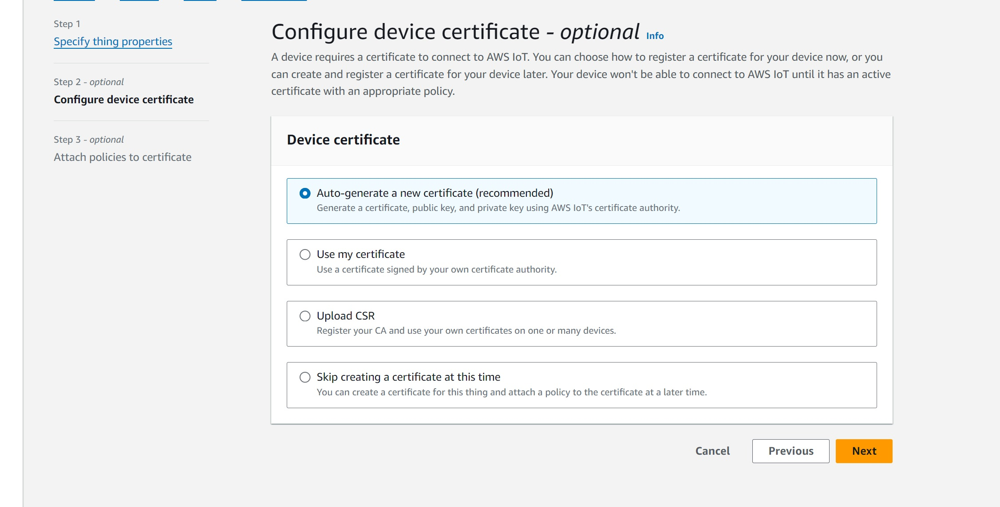

Download certificates

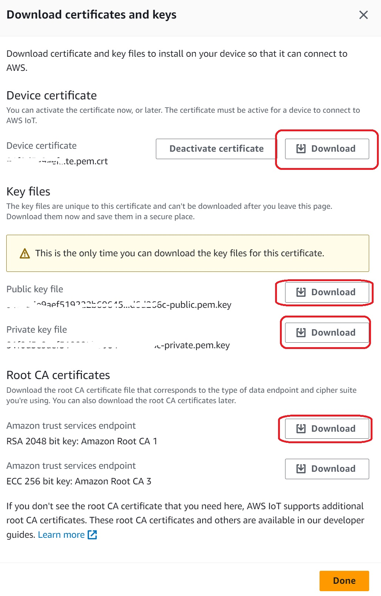

After created thing name "EPDominoThing24", the screen is below:

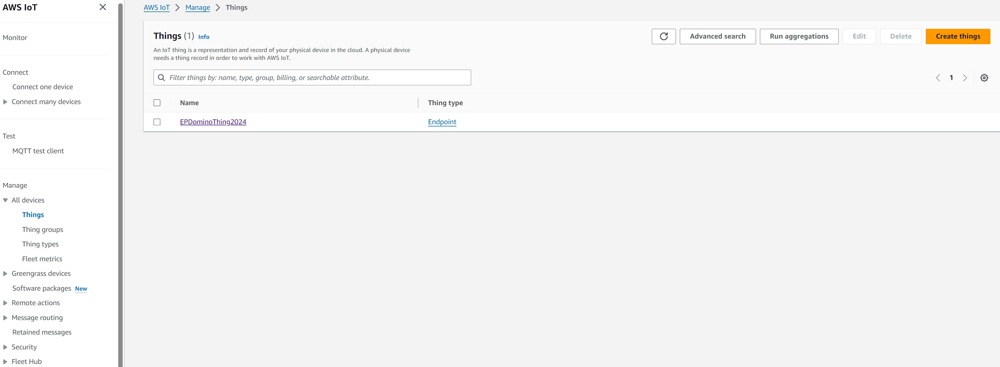

## Certificates

- Device certificate: This file usually ends with ".pem.crt". When you download this it will save as .txt file extension in windows. Save it in your certificates directory as 'certificates\certificate.cert.pem' and make sure that it is of file type '.pem', not 'txt' or '.crt'

- Device public key: This file usually ends with ".pem" and is of file type ".key". Save this file as 'certificates\certificate.public.key'.

- Device private key: This file usually ends with ".pem" and is of file type ".key". Save this file as 'certificates\certificate.private.key'. Make sure that this file is referred with suffix ".key" in the code while making MQTT connection to AWS IoT.

- Root certificate: Download from https://www.amazontrust.com/repository/AmazonRootCA1.pem. Save this file to 'certificates\AmazonRootCA1.crt'

### Converting Device Certificate from .pem to .pfx 

In order to establish an MQTT connection with the AWS IoT platform, the root CA certificate, the private key of the thing, and the certificate of the thing/device are needed. The .NET cryptographic APIs can understand root CA (.crt), device private key (.key) out-of-the-box. It expects the device certificate to be in the .pfx format, not the .pem format. Hence we need to convert the device certificate from .pem to .pfx.

We'll leverage the openssl for converting .pem to .pfx. Navigate to the folder where all the security artifacts are present and launch bash for Windows 10.

The syntax for converting .pem to .pfx is below:

```
openssl pkcs12 -export -in iotdevicecertificateinpemformat -inkey iotdevivceprivatekey -out devicecertificateinpfxformat -certfile rootcertificatefile
```

## Create Policies

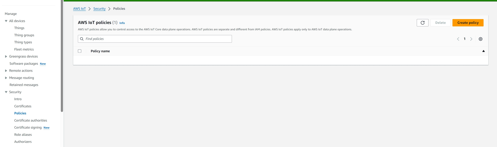

Name new policy EPDomino24PolicyAll and use \* means all action and resource

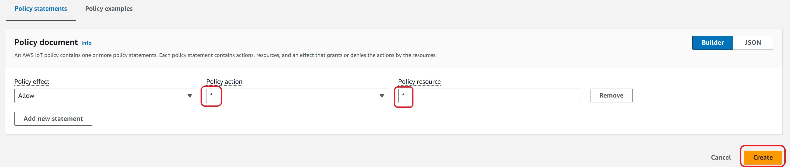

## Attach Policies

Back to Certificates, select Attach policies

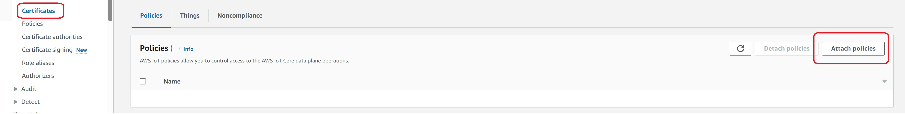

The screen is below:

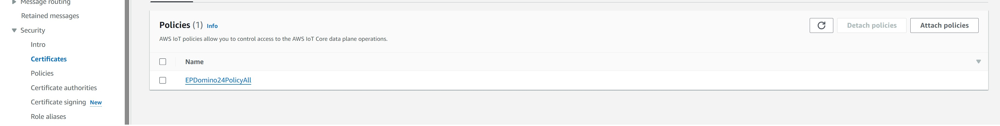

## Test Publisher

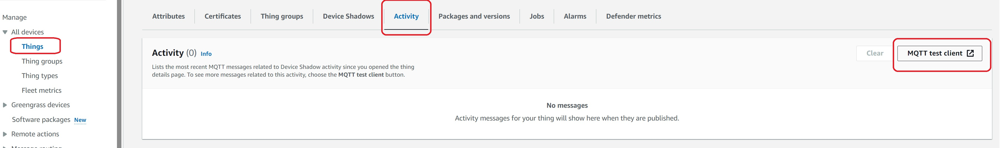

All message from/to the device can be seen here:

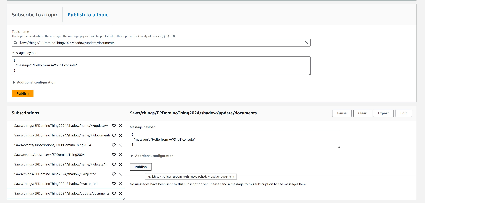

> [!Tip] 
The ```"string iotEndpoint = "your iot endpoint";```  variable can be found here:

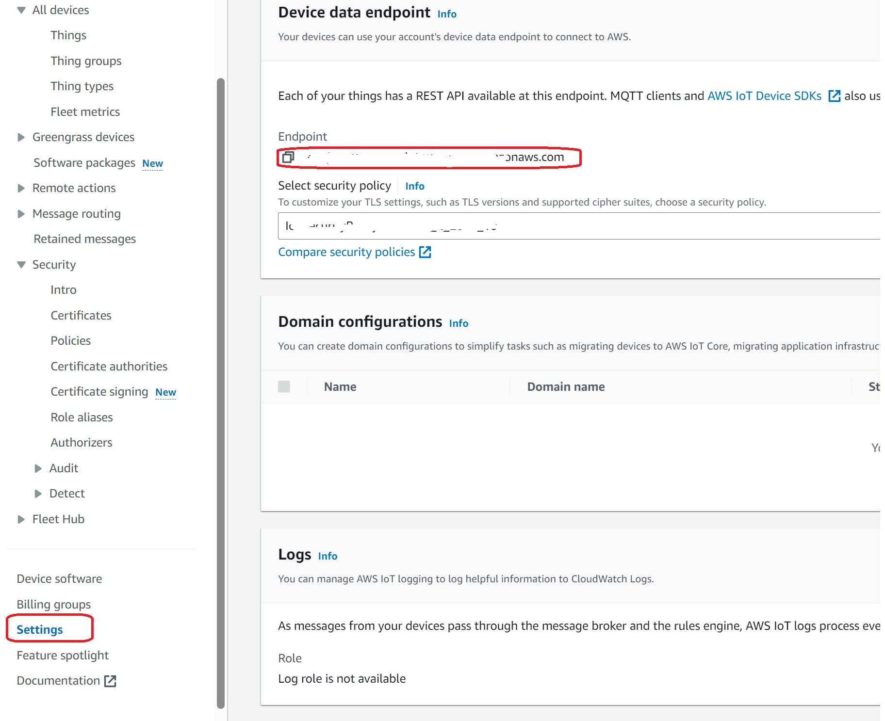
