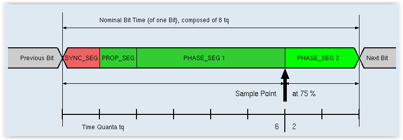

[IN PROGRESS](error.md) 
# CAN
---
Controller Area Network (CAN) bus is a serial communication protocol with built-in error checking and retransmission. It is generally a two wire bus, but other transceivers with one wire or LSFT (Low Speed Fault Tolerant) are used.

The common high-speed two-wire CAN requires termination resistors at the end of the wires, typically 120 ohm.


> [!TIP]
> Some CAN devices, including our own development boards, have built in termination resistors.

Endpoint supports CAN through `GHIElectronics.Endpoint.Devices.Can` NuGet package.


CAN bit timing is a complex topic that requires considerable knowledge of the CAN protocol. All nodes on a CAN network must use the same baud rate. Sample bit timing settings are provided further down on this page to help you get started.

`SetNominalBitTiming()` and `SetDataBitTiming()` define the CAN bus timing using the arguments listed below. Note that `SetDataBitTiming()` is only used for CAN-FD to specify the faster data rate. `SetNominalBitTiming()` is used both for standard CAN and to define the slower data bit rate for CAN-FD.

> [!TIP]
> The `propagationPhase1` argument combines the propagation and phase1 CAN timing parameters.

| Baud | Propagation+Phase1 | Phase2 | Baudrate Prescaler | Synchronization Jump Width | Use Multi Bit Sampling | Sample Point | Max Osc. Tolerance | Max Cable Length
|---|---|---|---|---|---|---|---|---|
| 33.333K | 13 | 2 | 90 | 1 | False | 87.5% | 0.31% | 2200M
| 83.333K | 13 | 2 | 36 | 1 | False | 87.5% | 0.31% | 850M
| 125K    | 13 | 2 | 24 | 1 | False | 87.5% | 0.31% | 550M
| 250K    | 13 | 2 | 12 | 1 | False | 87.5% | 0.31% | 250M
| 500K    | 13 | 2 | 6  | 1 | False | 87.5% | 0.31% | 100M
| 1M      | 13 | 2 | 3  | 1 | False | 87.5% | 0.31% | 40M

> [!Note]
The table above is calculated base on 40MHz clock source.

There are many online CAN calculators that can be used to help you with CAN timing, for [example](http://www.bittiming.can-wiki.info/).



The CAN calculator needs the microcontroller's CAN clock speed. For the SITCore series SC20xxx, this is 48 MHz. For the SC13xxx the speed is 40MHz. These can easily be found with `SourceClock` property.

## Filtering
Filters can be set to automatically accept or ignore messages based on their arbitration ID.

> [!Tip]
>On SC20xxx, each CAN channel supports up to 64 standard IDs and 32 Extended IDs. SC13xxx supports up to 14 filters.


### Range Filter
`AddRangeFilter()` allows you to set a range of arbitration IDs that will be accepted as valid messages. Messages with arbitration IDs outside of this range will be ignored. You can add more than one range filter. In the sample code below, the range filters will accept messages with arbitration IDs ranging from `0x12` to `0x20` and also between `0x500` and `0x1000` inclusive.

> [!Note]
Only SC20xxx supports Range Filter, SC13xxx doesn't.

### Mask Filter
`AddMaskFilter()` can be used to specify an individual arbitration ID or a range of arbitration IDs that will be accepted regardless of the group filter settings. If the arbitration ID of the message is bitwise anded with the given mask argument, and the result is equal to the compare argument you provide, the message will be accepted.

In the sample code below, CAN messages with arbitration IDs of `0x11`, `0x13`, and `0x5678` will be accepted in addition to the arbitration IDs specified by the group filters.


---
## Sample Code
 
```cs


var canController = new CanController(EPM815.Can.Can2, 250_000, 500_000);

int messageCount = 0;
canController.MessageReceived += (a) =>
{
    messageCount++;
    Console.WriteLine("Receiving message: " + messageCount);
};

canController.ErrorReceived += (a, b) =>
{
    uint error = (uint)b.Error;
    if ((error & (uint)CanError.ErrorBusOff) == (uint)CanError.ErrorBusOff)
    {
        Console.WriteLine("Error bus off");
    }
    else
    {
        Console.WriteLine("Receiving error: 0x" + error.ToString("x8"));
    }
};

// Set optional filters
canController.Disable();
canController.EnableFilter(new uint[] { 0x123 }, new uint[] { 0x000007FF }, true);
canController.EnableError(0x1FF);
canController.Enable();


// Read messages
if (canController.MessagesToRead > 0)
{
    var msgRead = canController.Read();

    if (msgRead != null)
    {
        Console.WriteLine("ID: " + msgRead.ArbitrationId.ToString("x8"));
        Console.WriteLine("Ext: " + msgRead.ExtendedFrameFormat);
        Console.WriteLine("Remote: " + msgRead.RemoteTransmissionRequest);
    }
}

// Write message
var msgWrite = new CanMessage()
{
    Data = new byte[] { 0x48, 0x65, 0x6C, 0x6C, 0x6F, 0x2E, 0x20, 0x20 },
    ArbitrationId = 0x11,
    Length = 6,
    RemoteTransmissionRequest = false,
    ExtendedFrameFormat = false,
    FdCan = false,
    BitRateSwitch = false
};
canController.Write(msgWrite);


```

---

## CAN-FD
CAN-FD allows for faster data transmission and larger data packet size to increase throughput. At the same time, CAN-FD is compatible with traditional CAN -- CAN-FD and standard CAN nodes can even coexist on the same CAN bus!

CAN-FD can be used by setting the `FdCan` property of your CAN message to `true`. This setting will allow you to send up to 64 bytes of data per CAN message.

To send the data at higher speed you will also need to set two bit timings, one for the normal, slower speed (`SetNominalBitTiming()`), and one for the faster speed (`SetDataBitTiming()`). You will also have to set the `BitRateSwitch` property of the CAN message to `true.`

The following code shows the changes needed to make the above code sample use CAN-FD with speeds of 250 kilobaud and 1 megabaud.


```cs
var propagationPhase1 = 13; //250 kilobaud settings
var phase2 = 2;
var baudratePrescaler = 12;
var synchronizationJumpWidth = 1;
var useMultiBitSampling = false;

//Set the lower CAN speed to 250 kilobaud.
can.SetNominalBitTiming(new CanBitTiming(propagationPhase1, phase2, baudratePrescaler,
    synchronizationJumpWidth, useMultiBitSampling));

baudratePrescaler = 3;  //Change bit timing to 1 megabaud.
        
//Set faster CAN speed to 1 megabaud.
can.SetDataBitTiming(new CanBitTiming(propagationPhase1, phase2, baudratePrescaler,
    synchronizationJumpWidth, useMultiBitSampling));

can.Enable();

var message = new CanMessage() {
    Data = new byte[] { 0x48, 0x65, 0x6C, 0x6C, 0x6F, 0x2E, 0x20, 0x20 },
    ArbitrationId = 0x11,
    Length = 6,
    RemoteTransmissionRequest = false,
    ExtendedId = false,
    FdCan = true,
    BitRateSwitch = true
};

```
