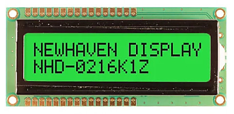

# Displays
---
Graphical Displays can be grouped into two distinct interface categories, built-in parallel TFT displays and virtual displays, typically serial (SPI/I2C) displays. 

The display drivers are meant to transfer the pixel data from memory to the actual display. The [graphics](graphics.md) tutorial shows how drawing is done in memory.

---

## Native Displays
These displays connect to special dedicated pins on the processor. Internally, the display controller automatically transfers (refreshes) the display directly from memory without any processor interaction, using DMA. When the system needs to update the display, it simply writes to memory. Neither the operating system nor the application program are burdened with display processing. The down side to this is that the system needs to have enough RAM to handle the display. An 800x600 display with 16bpp needs 960,000 bytes!

A display must be configured inside the .NET project. To do this create a .NET project with configuration code based on the type of display being used. In the example below an [ERTFT043 display and Endpoint Domino](../hardware/sbc.md) are used.

> [!Tip]
> Needed NuGets: GHIElectronics.Endpoint.Core, GHIElectronics.Endpoint.Devices.Display

```cs
using System.Device.Gpio;
using System.Device.Gpio.Drivers;
using SkiaSharp;
using GHIElectronics.Endpoint.Core;
using GHIElectronics.Endpoint.Devices.Display;

//Initialize Display
var backlightPort = EPM815.Gpio.Pin.PD14 / 16;
var backlightPin = EPM815.Gpio.Pin.PD14 % 16;
var backlightDriver = new LibGpiodDriver((int)backlightPort);
var backlightController = new GpioController(PinNumberingScheme.Logical, backlightDriver);
backlightController.OpenPin(backlightPin);
backlightController.SetPinMode(backlightPin, PinMode.Output);
backlightController.Write(backlightPin, PinValue.High);
var screenWidth = 480;
var screenHeight = 272;

var configuration = new FBDisplay.ParallelConfiguration(){
    Clock = 10000,
    Width = 480,
    Hsync_start = 480 + 2,
    Hsync_end = 480 + 2 + 41,
    Htotal = 480 + 2 + 41 + 2,
    Height = 272,
    Vsync_start = 272 + 2,
    Vsync_end = 272 + 2 + 10,
    Vtotal = 272 + 2 + 10 + 2,
};
var fbDisplay = new FBDisplay(configuration);
var displayController = new DisplayController(fbDisplay);

//SkiaSharp Initialization
SKBitmap bitmap = new SKBitmap(screenWidth, screenHeight, SKImageInfo.PlatformColorType, SKAlphaType.Premul);
bitmap.Erase(SKColors.Transparent);

// Setup the Canvas
using (var screen = new SKCanvas(bitmap)){

      ///////////////////////////////////////////
     // Place SkiaSharp Graphics content here //
    ///////////////////////////////////////////

    // Flush to screen
    var data = bitmap.Copy(SKColorType.Rgb565).Bytes;
    displayController.Flush(data);
    Thread.Sleep(1);
}
```
---

## Virtual Displays
The internal graphics services can be mapped to work with virtual display displays, such as SPI displays. See the [Graphics](graphics.md) tutorial for more information and sample code.

---

## Character Displays


These displays are capable of only showing characters. They are available in different sizes, but two lines of 16 characters is most common. These displays types use the standard .NET [Iot.Device.CharacterLcd](https://learn.microsoft.com/en-gb/dotnet/api/iot.device.characterlcd?view=iot-dotnet-latest) library