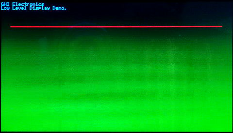

# Graphics

---
The `GHIElectronics.Endpoint.Devices.Display` NuGet package includes the backbone for all graphics needs. It uses [SkiaSharp](https://learn.microsoft.com/en-us/xamarin/xamarin-forms/user-interface/graphics/skiasharp/) Graphics library their API can be found [here](https://learn.microsoft.com/en-us/dotnet/api/skiasharp?view=skiasharp-2.88)


---

## Native Displays

Native display support in Endpoint is handled automatically using the microcontroller's DMA to transfer data in parallel to the display without slowing down your application.

The Endpoint Domino used in this example expects each pixel to have 16 bits (two bytes per pixel) of color information in RGB565 format.

The following example is written for the Endpoint Domino with the 4.3" display connected to the on-board FPC.

> [!Tip]
> Needed NuGets: GHIElectronics.Endpoint.Core, GHIElectronics.Endpoint.Display

```cs
using System.Device.Gpio;
using System.Device.Gpio.Drivers;
using SkiaSharp;
using GHIElectronics.Endpoint.Core;
using GHIElectronics.Endpoint.Devices.Display;

var backlightPort = EPM815.Gpio.Pin.PD14 / 16;
var backlightPin = EPM815.Gpio.Pin.PD14 % 16;

var gpioDriver = new LibGpiodDriver((int)backlightPort);
var gpioController = new GpioController(PinNumberingScheme.Logical, gpioDriver);
gpioController.OpenPin(backlightPin);
gpioController.SetPinMode(backlightPin, PinMode.Output);
gpioController.Write(backlightPin, PinValue.High);

var screenWidth = 480;
var screenHeight = 272;

SKBitmap bitmap = new SKBitmap(screenWidth, screenHeight, SKImageInfo.PlatformColorType, SKAlphaType.Premul);
bitmap.Erase(SKColors.Transparent);

var configuration = new FBDisplay.ParallelConfiguration(){
    Clock = 10000,
    Width = 480,
    Hsync_start = 480 + 2,
    Hsync_end = 480 + 2 + 41,
    Htotal = 480 + 2 + 41 + 2,
    Height = 272,
    Vsync_start = 272 + 2,
    Vsync_end = 272 + 2 + 10,
    Vtotal = 272 + 2 + 10 + 2,

};
var fbDisplay = new FBDisplay(configuration);
var displayController = new DisplayController(fbDisplay);

while (true){
    //Initialize Screen
    using (var screen = new SKCanvas(bitmap)){
        //Create Black Screen 
        screen.DrawColor(SKColors.Black);
        screen.Clear(SKColors.Black); //same thing but also erases anything else on the canvas first
        
        // Draw text
        using (SKPaint text = new SKPaint()){
            text.Color = SKColors.Yellow;
            text.IsAntialias = true;
            text.StrokeWidth = 1;
            text.Style = SKPaintStyle.Stroke;
            screen.DrawText("Hello World", 20, 20, text);
        }
    
        // Flush to screen
        var data = bitmap.Copy(SKColorType.Rgb565).Bytes;
        displayController.Flush(data);
        Thread.Sleep(1);
        
    }
}
```

Endpoint Domino connected to 4.3" display after running the sample code:




---

## Virtual Displays

Displays can be virtual, meaning the system handles the drawing in RAM and when `Flush` is called an event is fired with the graphics data that needs to be transferred to the display. This for example can be an SPI display or over-the-network display.

The following sample code runs on our SC20100S Dev Board with its SPI-based display. You will need to add a font and a small JPG image as [resources](resources.md) to run the code as is.

> [!Tip]
> Needed NuGets: GHIElectronics.TinyCLR.Core, GHIElectronics.TinyCLR.Devices.Display, GHIElectronics.TinyCLR.Devices.Gpio, GHIElectronics.TinyCLR.Devices.I2c, GHIElectronics.TinyCLR.Devices.Spi, GHIElectronics.TinyCLR.Drawing, GHIElectronics.TinyCLR.Drivers.Sitronix.ST7735, GHIElectronics.TinyCLR.Native, GHIElectronics.TinyCLR.Pins.

```cs
using System;
using System.Drawing;
using System.Threading;
using GHIElectronics.TinyCLR.Devices.Gpio;
using GHIElectronics.TinyCLR.Devices.Spi;
using GHIElectronics.TinyCLR.Drivers.Sitronix.ST7735;
using GHIElectronics.TinyCLR.Pins;

namespace GraphicsSample {
    class Program {
        private static ST7735Controller st7735;
        private const int SCREEN_WIDTH = 160;
        private const int SCREEN_HEIGHT = 128;

        private static void Main() {
            var spi = SpiController.FromName(SC20100.SpiBus.Spi4);
            var gpio = GpioController.GetDefault();

            st7735 = new ST7735Controller(
                spi.GetDevice(ST7735Controller.GetConnectionSettings
                (SpiChipSelectType.Gpio, gpio.OpenPin(SC20100.GpioPin.PD10))), //CS pin.
                gpio.OpenPin(SC20100.GpioPin.PC4), //RS pin.
                gpio.OpenPin(SC20100.GpioPin.PE15) //RESET pin.
            );

            var backlight = gpio.OpenPin(SC20100.GpioPin.PA15);
            backlight.SetDriveMode(GpioPinDriveMode.Output);
            backlight.Write(GpioPinValue.High);

            st7735.SetDataAccessControl(true, true, false, false); //Rotate the screen.
            st7735.SetDrawWindow(0, 0, SCREEN_WIDTH-1, SCREEN_HEIGHT-1);
            st7735.Enable();

            // Create flush event
            Graphics.OnFlushEvent += Graphics_OnFlushEvent;

            // Create bitmap buffer
            var screen = Graphics.FromImage(new Bitmap(SCREEN_WIDTH, SCREEN_HEIGHT));

            var image = Resources.GetBitmap(Resources.BitmapResources.
                smallJpegBackground);

            var font = Resources.GetFont(Resources.FontResources.small);

            screen.Clear();

            screen.FillEllipse(new SolidBrush(System.Drawing.Color.FromArgb
                (255, 255, 0, 0)), 0, 0, 80, 64);

            screen.FillEllipse(new SolidBrush(System.Drawing.Color.FromArgb
                (255, 0, 0, 255)), 80, 0, 80, 64);

            screen.FillEllipse(new SolidBrush(System.Drawing.Color.FromArgb
                (128, 0, 255, 0)), 40, 0, 80, 64);

            screen.DrawImage(image, 56, 50);

            screen.DrawRectangle(new Pen(Color.Yellow), 10, 80, 40, 25);
            screen.DrawEllipse(new Pen(Color.Purple), 60, 80, 40, 25);
            screen.FillRectangle(new SolidBrush(Color.Teal), 110, 80, 40, 25);

            screen.DrawLine(new Pen(Color.White), 10, 127, 150, 127);
            screen.SetPixel(80, 92, Color.White);

            screen.DrawString("Hello world!", font, new SolidBrush(Color.Blue), 50, 110);

            screen.Flush();
            Thread.Sleep(Timeout.Infinite);
        }

        private static void Graphics_OnFlushEvent(Graphics sender, byte[] data, int x, int y, int width, int height, int originalWidth) {
            st7735.DrawBuffer(data);
        }
    }
}
```

---

## Helper Methods

With parallel native displays the `DisplayController.ActiveConfiguration` can be used to read the configuration at any time. The Width and Height can be used to write code that automatically scales to the display's resolution. The following line of code draws a line from corner to corner, no matter the display resolution.

```cs
screen.DrawLine(new Pen(Color.Red), 0, 0, displayController.ActiveConfiguration.Width - 1,
    displayController.ActiveConfiguration.Height - 1);
```

---

## Images

TinyCLR OS supports BMP, GIF, and JPG file formats. See the [Image Decoders](image-decoders.md) page.

---

## Fonts

Fonts are fully supported. They are covered [here](font-support.md).

---

## Color Space

Internally, TinyCLR uses 5:6:5 RGB 16BPP color space. There are helper methods to convert to other color spaces. See [Encoding & Decoding](encoding-decoding.md) for more details.

---
## 2D Matrix copy

The built-in native 2D Matrix extract/copy is an simple, fast and efficient way to crop out an area of an image. `GroupSize` is the pixel size in bytes. TinyCLR OS is 16bpp graphics, that is `GroupSize = 2`.

```cs
var groupSize = 2;
var screenWidth = 160;
var screenHeight = 128;
 
var screen = new Bitmap(screenWidth, screenHeight);

var imageNew = new byte[80 * 80 * 2];
var x = 5;
var y = 5;
var width = 80;
var height = 80;

Array.Copy2D(screen.GetBitmap(), imageNew, x, y, width, height, screenWidth, groupSize);
```
---

## VNC

VNC (Virtual Network Computing) is a simple remote desktop that with available terminals supported by major operating systems. It is covered [here](vnc.md).