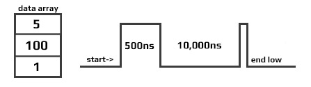

# Signal Control
---


## DigitalSignal

The DigitalSignal is used to handle digital signals! Unlike the other features on this page, DigitalSignal is accurate because it is hardware-backed and runs in a non-blocking manner.

Being hardware backed, this feature only runs on two specific pins: `EPM815.Gpio.Pin.PH10` (Timer5) and `EPM815.Gpio.Pin.PA5` (Timer2)

> [!TIP]
> Timers are also used with other features, such as PWM. Once a `Timer` is reserved for DigitalSignal, it is no longer available for other features.

There are two uses for DigitalSignal, reading a signal (capture) and sending a signal (generate). The capture feature also support capturing a stream of durations (signal analyzer) or a pulse counter.

### Generate

Using the `Generate` function allows the user to create a very accurate signal generator.  

```cs
Generate(uint[] data, uint offset, int count)
```

`data` is the length of each pulse in ticks

There is a limitation to the `data` being used: The `data` array length is limited to 64K elements. Also, adding individual elements together in the array can also not exceed 0xFFFFFFFF in total.
 

  
```cs
Generate(uint[] data, uint offset, int count, uint multiplier, Edge edge)
```
Allowed multiplier values range from 5 to 318,000 (318us). 

The signal generator start with a signal at `edge` level. It then toggles the signal every x time. The time is fetched from the array given, one by one. Note that by sending an even count of pulses, the signal will terminate with a `!edge` level as shown below.


Starting a second write will cause the signal to first go low, which may not be desired, as it causes an extra pulse on the next `Generate`. This pulse has a variable width. Making sure that the data `Length` is always an odd number will assure that the signal will terminate at a low-level.

 

Calling `Generate` will return immediately (non-blocking) allowing the system to do other tasks while the signal is being generated in the background. When the signal is generated completely, an event is fired. To aid in signal handling, the event provides the final resting level of the signal.

```cs
OnGenerateFinished => OnGenerateFinished;

dsig.OnGenerateFinished += (a, b, c) => {
    if (b == GpioPinValue.High)
        Console.WriteLine("Write done, end state high");
    else
        Console.WriteLine("Write done, end state low");
   };
```

### Capture
The Capture feature returns an array of timestamps of individual durations. The returned values are in nanoseconds.

> [!TIP]
> Digital Signal is limited to the timer max value, which comes to be about 17.89 seconds. The `waitForEdge` helps by only starting the timer when there is an active pulse.

```cs
var digitalSignal = new DigitalSignalController(EPM815.Gpio.Pin.PA5);

bool waitForEdge = false;// Start capturing as soon as Capture is called

// Subscribe event when done capturing
digitalSignal.CaptureFinished += DigitalSignal_OnCaptureFinished;

// Subscribe error
digitalSignal.ErrorReceived += (a,b) => { 
	Console.WriteLine("Error detected: " + error.ToString());
};
                      
// start capture 100 samples, timeout is 15seconds
digitalSignal.Capture(100, EPM815.Gpio.Edge.Rising | EPM815.Gpio.Edge.Falling, waitForEdge, TimeSpan.FromSeconds(15));

// Wait for finish capture
// do other work
Thread.Sleep(Timeout.Infinite); 

// The event
private static void Digital_OnCaptureFinished(DigitalSignal sender, double[] buffer, uint count, uint initialState, bool aborted) {
    if (count == 0) {
        Console.WriteLine("no data was captured!");
        return;
    }
    for (int i = 0; i < count; i++) {
        Console.WriteLine("Sample [" + i +"]: "+ buffer[i]+" ns");
    }
}
```
> [!NOTE]
> The first captured pulse will likely have an inaccurate (shorter) value due to system prep-time.

### ReadPulse

ReadPulse can be used to measure frequency and other analyses that require measuring time duration for specific pulse count.

```cs
var digitalSignal = new DigitalSignalController(EPM815.Gpio.Pin.PH10);

bool waitForEdge = true;// wait for first pulse before starting the measurement

// Subscribe event when done reading
digitalSignal.OnReadPulseFinished += DigitalSignal_ReadPulseFinished;   

// Subscribe error
digitalSignal.ErrorReceived += (a,b) => { 
	Console.WriteLine("Error detected: " + error.ToString());
};        

// Start reading 1000 pulses
digitalSignal.ReadPulse(1000, EPM815.Gpio.Edge.Rising, waitForEdge);

// do other work...
Thread.Sleep(Timeout.Infinite);

// the event
void Digital_OnReadPulseFinished(DigitalSignal sender, TimeSpan duration, uint count, uint pinValue, bool aborted) {
    var ticks = duration.Ticks;
    var microsecond = ((double)duration.Ticks) / 10;
    var millisecond = ((double)duration.Ticks) / 10000;
    var freq = (count / microsecond) * 1000000;

    Console.WriteLine("GpioPinValue = " + ((pinValue == 1) ? "High" : "Low"));
    Console.WriteLine("PulseCount = " + count);
    Console.WriteLine("Duration ticks = " + ticks);
    Console.WriteLine("Duration microsecond = " + microsecond);
    Console.WriteLine("Duration millisecond = " + millisecond);
    Console.WriteLine("freq = " + freq / 1000.0 + " KHz");
}
```

---
### Abort

An event is fired when any `DigitalSignal` operation is completed. In some cases, it may be desired to terminate the operation early, using `Abort`. When aborted, an event is still triggered, which will contain whatever data/pulses was collected from the trigger to the time `Abort` was called.

```cs
var digitalSignal = new DigitalSignal(EPM815.Gpio.Pin.PH10);

var waitForEdge = false;

digitalSignal.OnReadPulseFinished += Digital_OnReadPulseFinished

while (true) {
    if (digitalSignal.CanReadPulse) {
        digitalSignal.ReadPulse(1000, EPM815.Gpio.Edge.Rising, waitForEdge);                  
        Thread.Sleep(1000);                    
        digitalSignal.Abort();
        Console.WriteLine("Aborted");
    }
}
      
void Digital_OnReadPulseFinished(DigitalSignal sender, TimeSpan duration, uint count, uint pinValue, bool aborted) {
    if (count > 0) {
        var microsecond = ((double)duration.Ticks) / 10;
        var freq = (count / microsecond) * 1000000;
        Console.WriteLine("freq = " + freq / 1000.0 + " KHz");
    }
    else {
        Console.WriteLine("No clock found.");
    }
}
```

> [!TIP] 
> In the sample code above you can use PWM to provide the pulse needed to verify the code. Keep in mind that both PWM and `DigitalSignal` share resources, so a different Timer controller must be used.


