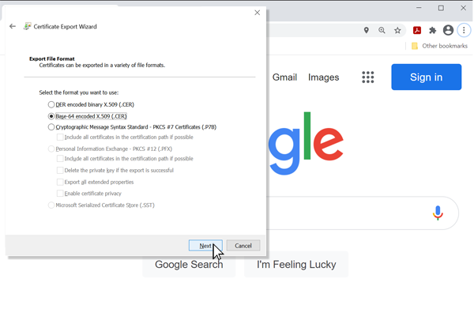

# TLS Client
---

TLS is how the Internet securely works, for banks, airports and security systems. We support TLS 1.3, a global security standard. All encryption, decryption and certification are done in secure internal memory to keep sensitive data safe.

Below is simple example showing how to connect to https://www.google.com 

>[!TIP]
>Needed NuGets: GHIElectronics.TinyCLR.Devices.Network, GHIElectronics.TinyCLR.Networking.Http

```cs
var url = "https://www.google.com";

var certificates = Resources.GetBytes(Resources.BinaryResources.GlobalSign);

X509Certificate[] certx509 = new X509Certificate[] { new X509Certificate(certificates) };

int read = 0, total = 0;
byte[] result = new byte[512];

try {
    using (var req = HttpWebRequest.Create(url) as HttpWebRequest){
        req.KeepAlive = false;
        req.HttpsAuthentCerts = certx509;
        req.ReadWriteTimeout = 2000;

        using (var res = req.GetResponse() as HttpWebResponse){
            using (var stream = res.GetResponseStream()){
                do {
                    read = stream.Read(result, 0, result.Length);
                    total += read;

                    System.Diagnostics.Debug.WriteLine("read : " + read);
                    System.Diagnostics.Debug.WriteLine("total : " + total);

                    var page = new String(System.Text.Encoding.UTF8.
                        GetChars(result, 0, read));

                    System.Diagnostics.Debug.WriteLine("Response : " + page);
                }
                while (read != 0);
            }
        }
    }
}
catch { 
}
```

## Entropy
TinyCLR OS uses the internal True Random Number (TRNG) generator to seed the entropy needed. Users can optionally provide their own.

```cs
networkInterfaceSetting.TlsEntropy = new byte[] { 0, 1, 2, 3 };
```

## Root Certificate
A root certificate is needed to access secure websites. TinyCLR OS accepts certificates in both text and binary formats. The following instructions show how to download certificates using Google as an example:

First click on the `lock` icon inside the URL window. 


Select `Certificate (Valid)` option. 


Select the `Certificate Path` TAB and click on the top Root certificate, select the Root Certificate


Next navigate to the `Details` TAB and click on the `Copy to File` button.


The Certificate Export Wizard page will appear, click `Next`


Select the `Base-64 encoded X.509(.CER)` file format and click `Next`



Name the file and browse to the location to save. Then click `Next`


An export confirmation message will appear, click `OK` and then click `Finish`

