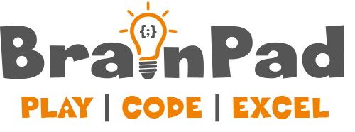
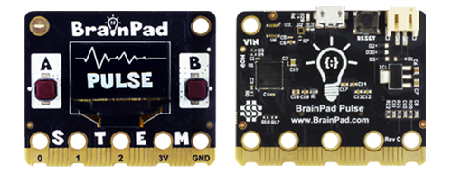
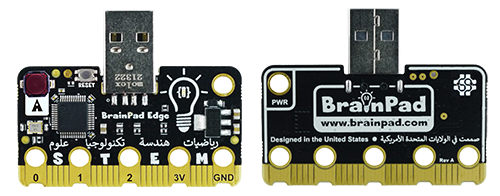
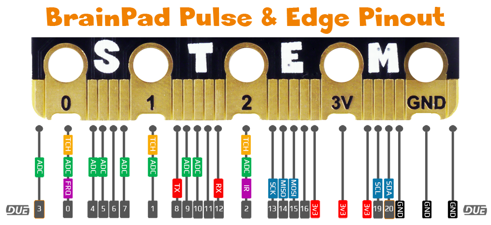
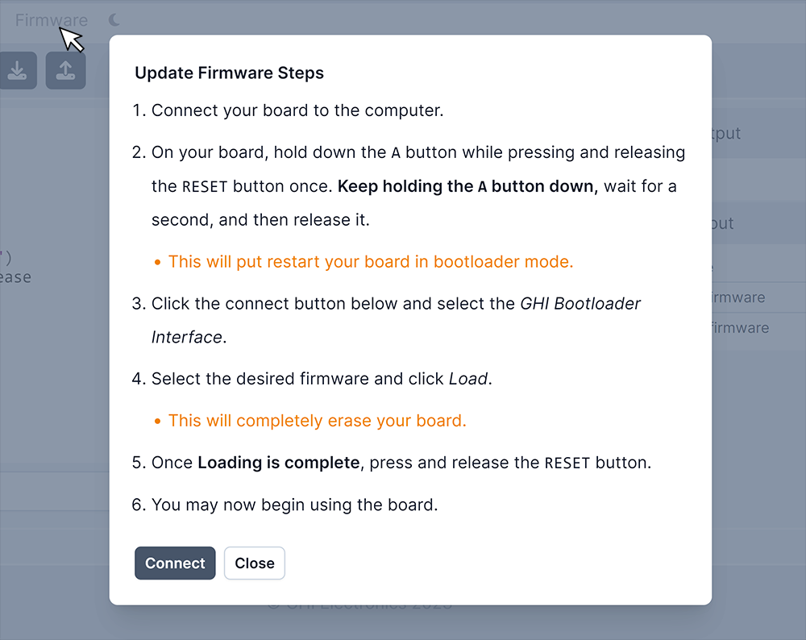
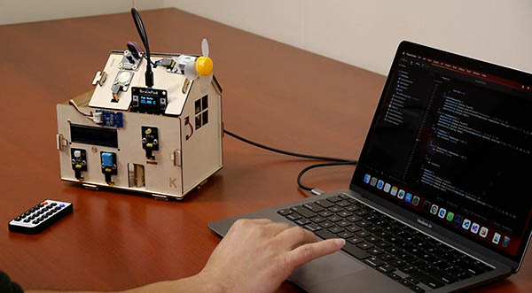
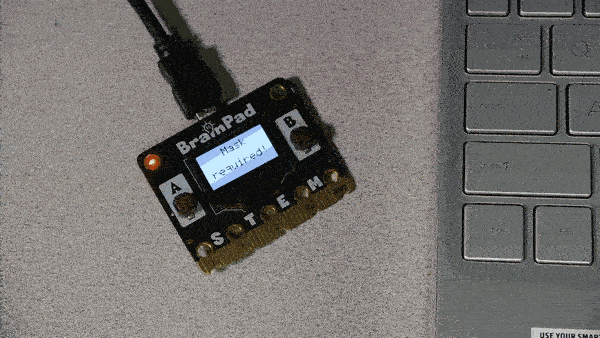
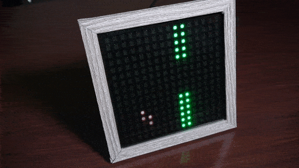

# BrainPad
---
 

Educators now have the power to use their beloved language-of-choice with BrainPad devices, thanks to the power of the DUE platform.

Both BrainPad Pulse and BrainPad Edge are fully supported. However, BrainPad Pulse include additional natively-supported, which are the display and the buzzer.

**BrainPad Pulse**
 

**BrainPad Edge**
 

 

**On-board Components**

|       | Pulse | Edge
---     | ---   | ---
LED|   ✓   |    ✓
Button A|   ✓   |    ✓
Button B|   ✓   |    
LCD     |   ✓   | 
Sound   |   ✓   |    

Visit the [BrainPad website](https://www.brainpad.com) to learn about the product and see purchasing options.

---

## Getting Ready
The first step is to load the appropriate firmware onto the device. Follow the steps found on the [DUE Console](https://console.duelink.com/) website under `Firmware` and select the appropriate DUE firmware. 

> [!TIP]
> The heart to the BrainPad Pulse is SITCore SC13 chipset. And for BrainPad Edge is SITCore SC007.

 

---

# Hardware Demos
The edge connector on the supported BrainPad hardware combined with the ease of the DUE platform, open up many possibilities to try the existing accessories available on the market. Here are just a few:

## Smart House
This example demonstrates the extensibility of the DUE platform. Using the DUE library from within full .NET. See the code samples repo for all the available sensors. We added a BrainClip IR remote control to our demo. 

[Smart House Sample Repo](https://github.com/ghi-electronics/due-samples/tree/main/BrainPad/SmartHome)

 

---

## A.I. Mask Detector
Harnessing the power of A.I. on a tiny micro-controller is a challenge, but easy work for the DUE platform. In this example full Python is used with the DUE platform connecting the pieces together. 

[A.I. Mask Detector Sample Repo](https://github.com/ghi-electronics/due-samples/tree/main/AI-MaskDetect/python)

 

---
## NeoPixel Matrix 
NeoPixel Matrix panels pair well with the DUE platform, because NeoPixel support is built-in. Using DUE you can quickly create games, images, or led-effects. In our samples repo, we demonstrate using DUE Script, Python, and .NET. and make a simple Falling Bird Game.

[Falling Bird Sample Repo](https://github.com/ghi-electronics/due-samples/tree/main/NeoMatrix/16x16/FallingBird)

[More NeoPixel Matrix Projects](../software/due-script/samples/neopixel-matrix.md)

 

---
## BrainGamer Sketch
Creating art is easy when you pair the BrainPad Pulse with the BrainGamer

[BrainGamer Sketch Demo](../software/due-script/samples/pulse-gamer-sketch.md)

