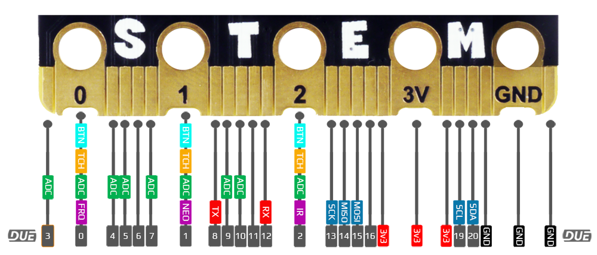

# BrainPad
---
 

Educators now have the power to use their beloved language-of-choice with BrainPad devices, thanks to the power of the DUE platform.

All BrainPad microcomputers are fully supported. However, BrainPad Pulse include additional natively-supported components, which are the display and the buzzer.

**BrainPad Pulse**
 

**BrainPad Edge**
 

**BrainPad Tick**
 

 

**On-board Components**

|       | Pulse | Edge	| Tick
---     | ---   | ---	| ---
LED		|   ✓   |   ✓	| 5x5
Button A|   ✓   |   ✓	| ✓
Button B|   ✓   |   ✓	| ✓
LCD     |   ✓   | 
Sound   |   ✓   |    

Visit the BrainPad website to learn about the product and see purchasing options.

---

## Beginner to Expert

We recommend beginners start out with the BrainPad, it is made for beginners and scales up to advanced learning. The [FEZ boards](fez.md) can then be used to start designing prototypes and proof of concepts. Low-volume products can be manufactured with ease, thanks to the small form factor and SMT solderability of the FEZ boards. 

> [!TIP]
> The heart to the FEZ boards is [SITCore SC13](https://www.ghielectronics.com/sitcore/) chipset.

---

# Loading the Firmware
The first step to load the DUE firmware on your hardware is to navigate to the [console.duelink.com](https://https://console.duelink.com/) and click on the **Firmware** tab and follow the instructions

 

---
# Getting Started
The BrainPad website is a great place to get started, it shows the steps needed to start using the DUE Link ecosystem and coding options.

---

# Hardware Demos
The edge connector on the supported BrainPad hardware combined with the ease of the DUE platform, open up many possibilities to try the existing accessories available on the market. Here are just a few:

## Smart House
This example demonstrates the extensibility of the DUE platform. Using the DUE library from within full .NET. See the code samples repo for all the available sensors. We added a BrainClip IR remote control to our demo. 

[Smart House Sample Repo](https://github.com/ghi-electronics/due-samples/tree/main/BrainPad/SmartHome)

 

---

## A.I. Mask Detector
Harnessing the power of A.I. on a tiny micro-controller is a challenge, but easy work for the DUE platform. In this example full Python is used with the DUE platform connecting the pieces together. 

[A.I. Mask Detector Sample Repo](https://github.com/ghi-electronics/due-samples/tree/main/AI-MaskDetect/python)

 

---
## NeoPixel Matrix 
NeoPixel Matrix panels pair well with the DUE platform, because NeoPixel support is built-in. Using DUE you can quickly create games, images, or led-effects. In our samples repo, we demonstrate using DUE Script, Python, and .NET. and make a simple Falling Bird Game.

[Falling Bird Sample Repo](https://github.com/ghi-electronics/due-samples/tree/main/NeoMatrix/16x16/FallingBird)

[More NeoPixel Matrix Projects](../software/due-script/samples/neopixel-matrix.md)

 

---
## BrainGamer Sketch
Creating art is easy when you pair the BrainPad Pulse with the BrainGamer

[BrainGamer Sketch Demo](../software/due-script/samples/pulse-gamer-sketch.md)

---

## Beginner to Expert

We recommend beginners start out with the BrainPad, it is made for beginners and scales up to advanced learning. The [FEZ boards](fez.md) can then be used to start designing prototypes and proof of concepts. Low-volume products can be manufactured with ease, thanks to the small form factor and SMT solderability of the [FEZ boards](fez.md). 

 

