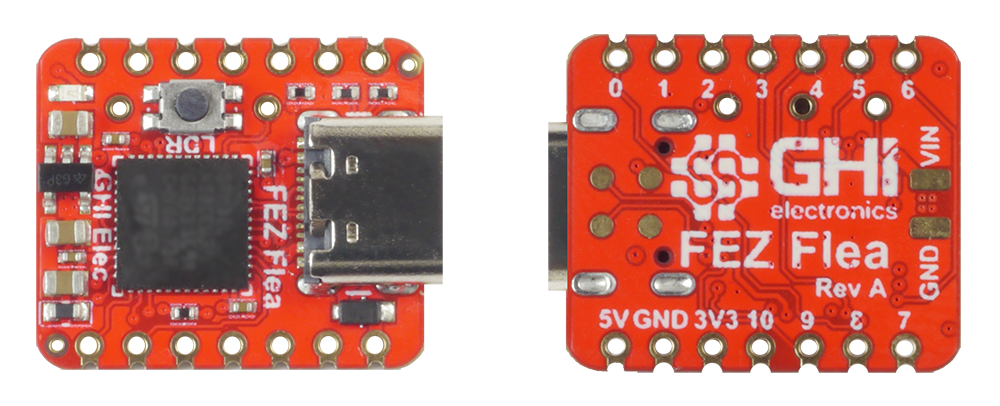
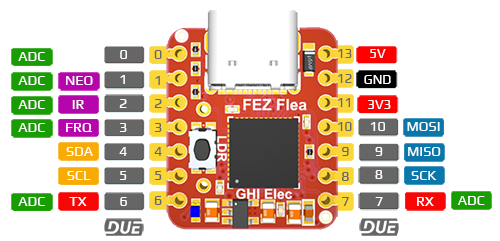
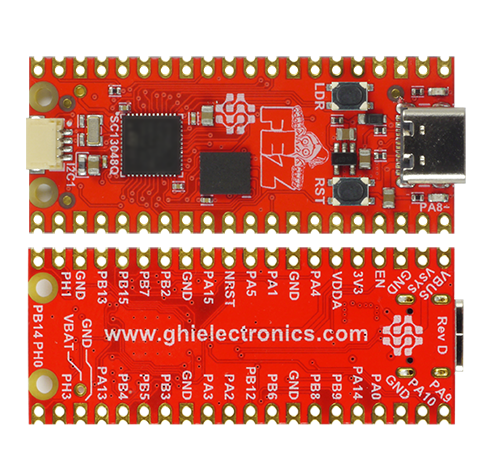
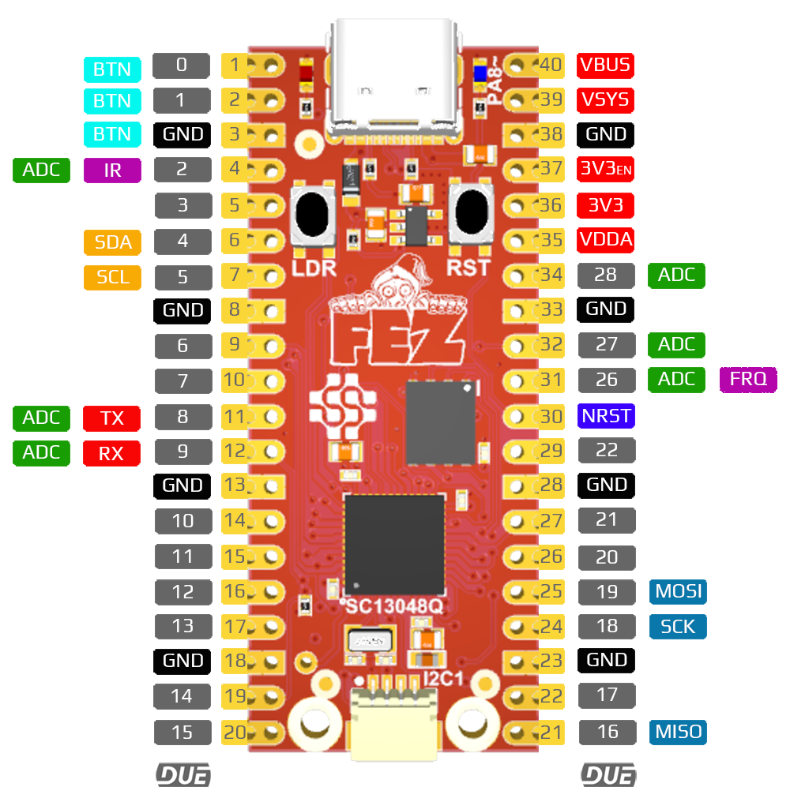
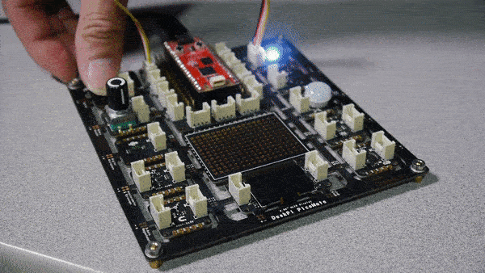
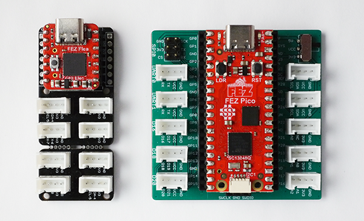
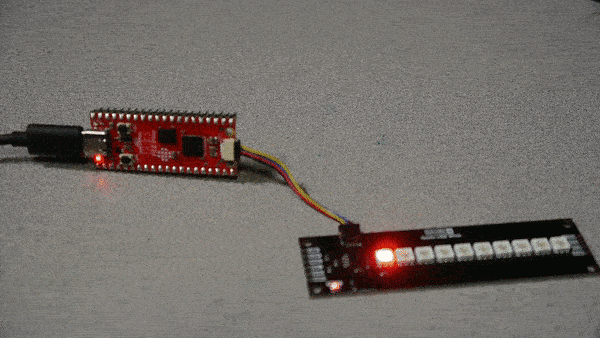
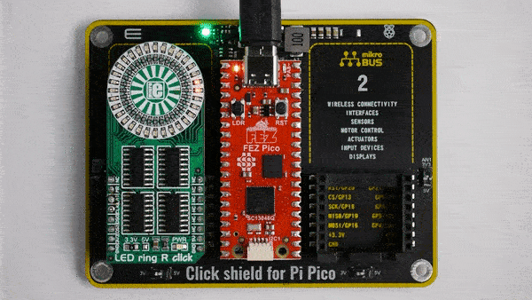

# FEZ
---
These FEZ products can be used with the DUE platform.

## FEZ Flea

The FEZ Flea form factor is the same as the Seeed Studio Xiao. This opens up the option for many existing accessories. 

The FEZ Flea can also be soldered to a PCB just like a SoM.

 

 

---

## FEZ Pico

The FEZ Pico form factor is the same as the Raspberry Pi Pico. This opens up the option for many existing accessories.

The FEZ Pico also includes a STEMMA connector that can connect to many existing STEMMA modules. 

 

---
## Getting Ready
The first step is to load the appropriate firmware onto the device. Follow the steps found at the BrainPad [loader page.](https://loader.brainpad.com) and select the appropriate DUE firmware. 

> [!TIP]
> The heart of both FEZ boards SITCore SC13 chipset.

 

---

# Hardware Demos

The supported hardware's form factor opens the opportunity to use some of the many available accessories on the market. Here are just a few examples. 

## PicoMate

The PicoMate is a single-pcb with multiple Grove compatible sensors that are removable or work in place. Samples in the repo demonstrate extending DUE with Python or .NET. 

[PicoMate Samples Repo](https://github.com/ghi-electronics/due-samples/tree/main/PicoMate)

 

---

## Grove Module Shields

These Grove shields are a great way to connect the many Grove modules on the market to DUE. There are many drivers located in the DUE samples driver repo to get you started.

[Drivers Repo](https://github.com/ghi-electronics/due-samples/tree/main/Drivers)

 

---

## Qwiic/STEMMA QT Connector

The built in JST connector on the FEZ Pico opens up the door for even more expansion options, using Qwiic or STEMMA QT sensors.

[LED Bar Demo](https://github.com/ghi-electronics/due-samples/tree/main/Drivers/LedBar)

 

---

## Mikroe Click Shield for Pico

Mikroe Electronica has 1000's of Click sensors available, this shield provides an interface to those modules. Our demo in DUE Samples repo uses the LEDRing Click module. 

> [!Warning] 
>  Click shield for Pi Pico has a major flaw. MISO and MOSI pins are swapped on board rev 1.00.

[LEDRing Click Module](https://github.com/ghi-electronics/due-samples/tree/main/Drivers/LedRingClick)

 