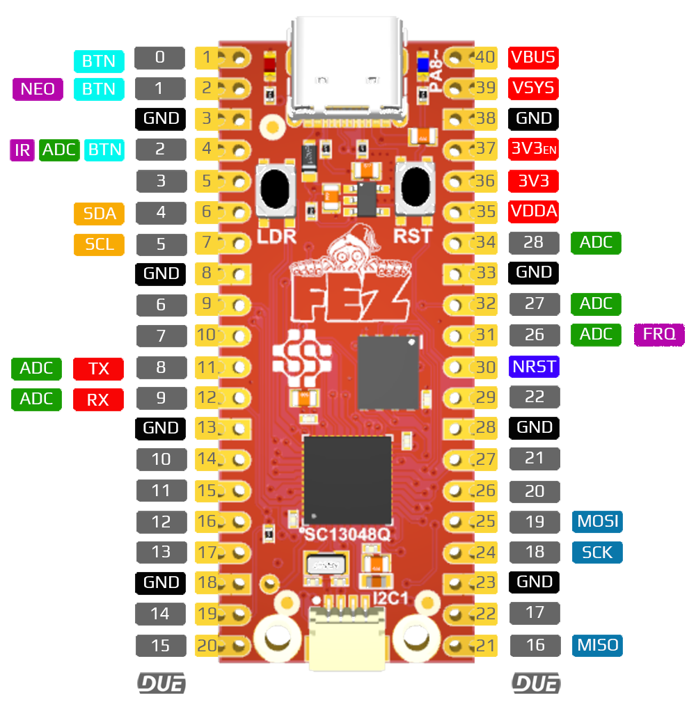

# FEZ
---
These FEZ products can be used with the DUE platform.

## FEZ Flea

The FEZ Flea form factor is the same as the Seeed Studio Xiao. This opens up the option for many existing accessories. 

The FEZ Flea can also be soldered to a PCB just like a SoM.

 

 

---

## FEZ Pico

The FEZ Pico form factor is the same as the Raspberry Pi Pico. This opens up the option for many existing accessories.

The FEZ Pico also includes a STEMMA connector that can connect to many existing STEMMA modules. 

 

---
# Hardware Demos

The supported hardware's form factor opens the opportunity to use some of the many available accesories on the market. Here are just a few examples. 

## PicoMate

The PicoMate is a single-pcb with multiple Grove compatible sensors that are removable or work in place. Samples in the repo demonstrate extending DUE with Python or .NET. 

[PicoMate Samples Repo](https://github.com/ghi-electronics/due-samples/tree/main/PicoMate)

 

---

## Grove Shield for Pico

This Grove shield is great for connect the many Grove modules on the market to DUE. There are many drivers located in the Due samples repo to get you started.

[Drivers Repo](https://github.com/ghi-electronics/due-samples/tree/main/Drivers)

 

---

## Qwiic/STEMMA QT Connector

The built in JST connector on the Pico opens up the door for even more expansion, using Qwiic or STEMMA QT sensors.

[Drivers Repo](https://github.com/ghi-electronics/due-samples/tree/main/Drivers)

 

