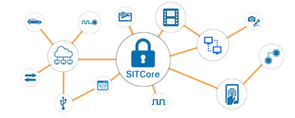
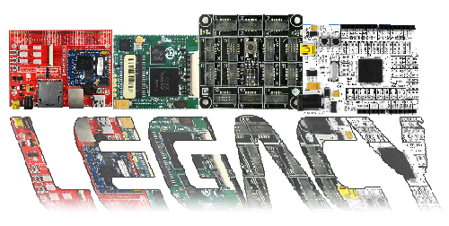

# Hardware
---

## SITCore

  

Secure IoT SoCs, SoMs and Dev Boards that run C# with full debugging over USB.   [**Learn More...**](sitcore/intro.md) 

---
## Legacy

Support for discontinued products.   [**Learn More...**](legacy/intro.md) 

---
## Legal

License, Disclaimer, Security.   [**More...**](../hardware/legal.md)  

---
You can also visit our main website at [**main website**](http://www.ghielectronics.com) and our  [**community forum**](https://forums.ghielectronics.com/).