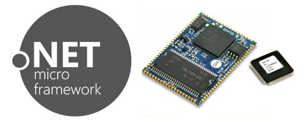

# Hardware
---

|  |  |
|---|---|
| **SITCore**   Secure IoT SoCs, SoMs and Dev Boards that run C# with full debugging over USB. [**Learn More...**](sitcore/intro.md) | **NETMF Modules**   A mature product line that is still in production running Microsoft's .NET Micro Framework. [**Learn More...**](netmf/intro.md) |
|  |  |
| **Legacy**   Support for discontinued products. [**Learn More...**](legacy/intro.md)| **Legal**   License, Disclaimer, Security. [**More...**](../hardware/legal.md) |
|  |  |
***

You can also visit our main website at [**www.ghielectronics.com**](http://www.ghielectronics.com) and our community forums at [**forums.ghielectronics.com**](https://forums.ghielectronics.com/).