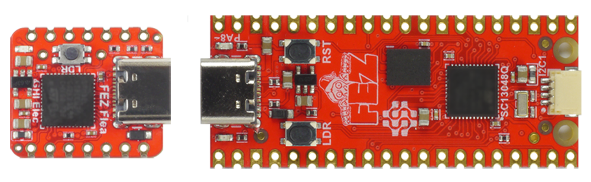

# DUE Hardware
---
The DUE platform is supported on several GHI Electronics' devices, including the educational BrainPad devices. If you're already a Maker then the FEZ options are a great place to jump in and start. If you're new to hardware then BrainPad is great option to get you started.

> [!NOTE]
> All DUE supported hardware has an on-board LED. It can be called using 'L', 'l', or pin 108 `dwrite(108,1)`

## BrainPad

 

Educators now have the power to use their beloved language-of-choice with BrainPad devices, thanks to the power of the DUE platform.

[**Learn more...**](brainpad.md)

---

## SITCore / FEZ

 

The power of DUE is available on a Fast-and-Easy (FEZ) developer-friendly boards.

[**Learn more...**](fez.md)