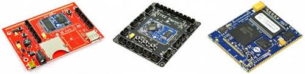
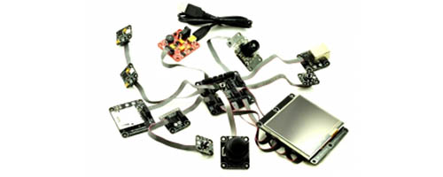
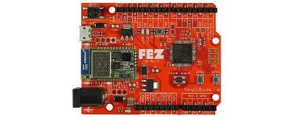
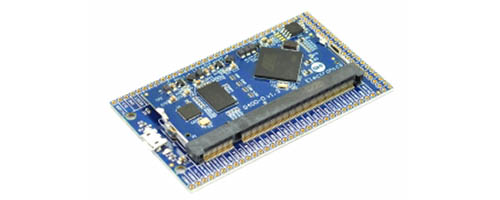
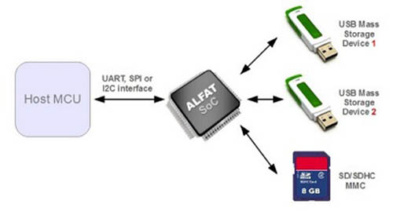
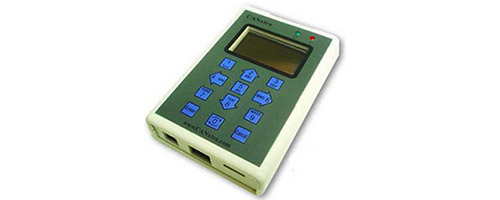
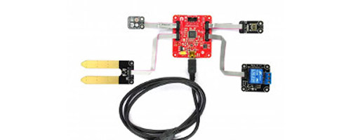
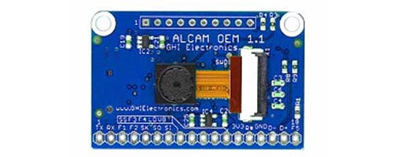
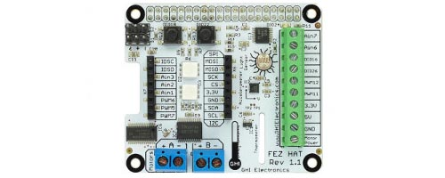
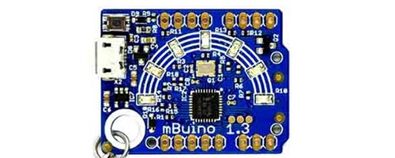

# Legacy Products Introduction
---

This section covers GHI Electronics legacy products. While we take pride in helping our customers maximize the lifetime of their products, these products are not recommended for new designs and are no longer covered by our free support. Check out our [Longevity Promise](https://new.ghielectronics.com/longevity/) to find out more about GHI Electronics' product life cycle.

---
## NETMF Modules
 
  [**Learn more...**](../netmf/intro.md) 

---
## Older SoMs
 
  [**Learn more...**](som.md) 

---
## Universal Modules

  [**Learn more...**](../ucm/intro.md) 

---
## Gadgeteer
  
  [**Learn more...**](../gadgeteer/intro.md) 

---
## Duino

  [**Learn more...**](../duino/intro.md)  

---
## Breakout

  [**Learn more...**](../breakout/intro.md)

---
## File System

  [**Learn more...**](../filesystem/intro.md) 

---
## Automotive
 
  [**Learn more...**](../automotive.md) 

---
## Gadgeteering

  [**Learn more...**](../gadgeteering.md) 

---
## Imaging

  [**Learn more...**](../imaging.md) 

---
## Raspberry PI Hats

  [**Learn more...**](../raspberrypi-hats.md) 

---
## mBuino

  [**Learn more...**](../mbuino.md)  

---

> [!Tip]
> Our [**community forum**](https://forums.ghielectronics.com/) is a great place to get help from our engineers and from thousands of community members: 

## Producing Legacy Products

GHI Electronic's products are all engineered and manufactured in-house.  While some of our older products are deemed legacy and not recommended for new designs, we can still produce them, however a minimum order may be required.

---

You can also visit our main website at [**main website**](http://www.ghielectronics.com) and our  [**community forum**](https://forums.ghielectronics.com/).