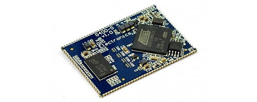

# NETMF Modules
---

These products have matured. They are in full production; however, NETMF software has been replaced by [TinyCLR OS 2.0](../../software/tinyclr/intro.md) software and [SITCore Modules](../sitcore/intro.md). Please consider switching ASAP.

---
## G30

  [**Learn more...**](g30.md) 

---
## G80

  [**Learn more...**](g80.md) 

---
## G120 / G120E

  [**Learn more...**](g120.md) 

---
## G400S

  [**Learn more...**](g400s.md) 

---
## Upgrading 

  [**Learn more...**](upgrade.md) 

---

You can also visit our main website at [**main website**](http://www.ghielectronics.com) and our  [**community forum**](https://forums.ghielectronics.com/).
