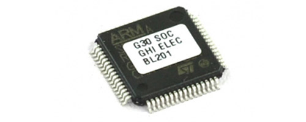
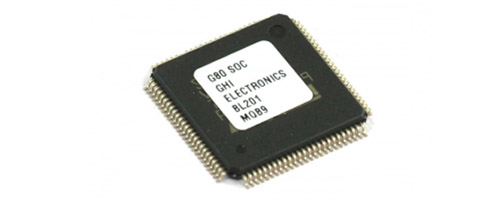
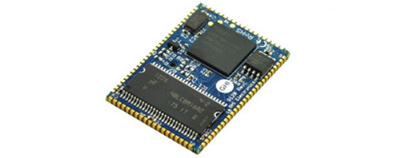

# NETMF Modules
---

These products have matured. They are in full production; however, NETMF software has been replaced by [TinyCLR OS 2.0](../../software/tinyclr/intro.md). Please consider switching to one of the new modules that support TinyCLR 2.0.

|  |  |
|--|--|
| **G30**   [**Learn more...**](g30.md) | **G80**   [**Learn more...**](g80.md) |
|  |  |
| **G120 / G120E**   [**Learn more...**](g120.md) | **G400S/G400D**   [**Learn more...**](g400d.md) |
|  |  |
| **Upgrading to SITCore**   [**Learn more...**](upgrade.md) |  |
|  |  |
 
***

You can also visit our main website at [**www.ghielectronics.com**](http://www.ghielectronics.com) and our community forums at [**forums.ghielectronics.com**](https://forums.ghielectronics.com/).