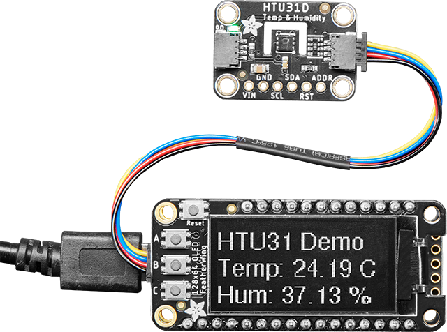
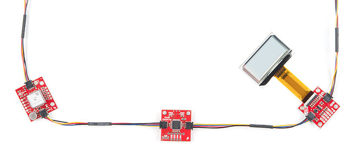
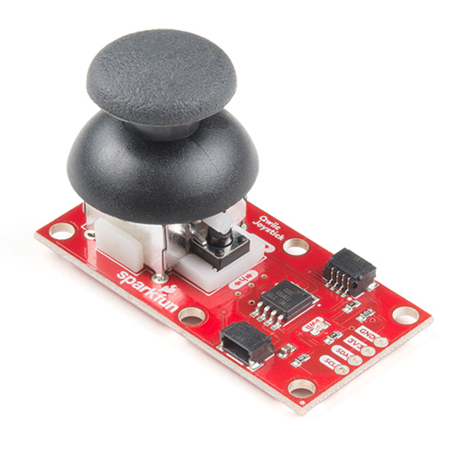

# Qwiic & STEMMA Modules

---

[Sparkfun Qwiic](https://www.sparkfun.com/qwiic) and [Adafruit STEMMA](https://www.adafruit.com/category/1005) modules are made to use the same tiny 4-pin connector. They utilize the I2C data bus to communicate with these modules. 



A good advantage of using these modules is the fact that they can be daisy chained.



DUELink supports the [I2C Bus](../software/api/i2c.md) natively. A relatively easy driver is needed to access the connected modules. We provide some examples for some and we can help with any necessary help.

Here is an example that reads Sparkfun Qwiic Joystick



From Spoarkfun docs an examples, we see that the joystick uses address `0x20`. Sending 3 command will return 5 

```py
write = [0x03]
read = [0,0,0,0,0]
while(True):
    DUELink.I2c.WriteRead(0x20,write,0,1,read,0,5)
    X = (read[0]<<8 | read[1])>>6
    Y = (read[2]<<8 | read[3])>>6
    print(X, Y, " Button = ", read[4])
```
