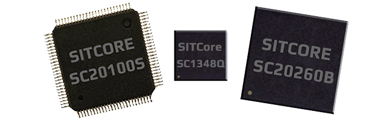
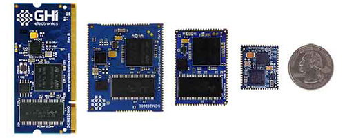
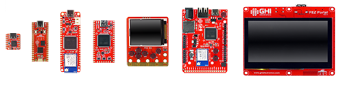

# SITCore
---
The SITCore line of products provides an easy way to create secure IoT and embedded devices that are programmable in C# using Visual Studio, thanks to [TinyCLR OS](../../software/tinyclr/intro.md). Designed with security as a top priority, your intellectual property is protected through device code protection, secure encrypted in-field and OTA update, and secure booting.

## Getting Started

Get started quickly with SITCore and TinyCLR OS.   [**Learn More...**](getting-started.md) 

---

## System on Chip
 

 Secure IoT chips that run C# and support debugging over USB.   [**Learn More...**](soc.md) 

---
## System on Modules

Available as a surface mount module and a 200 pin SO-DIMM module.   [**Learn More...**](som.md) 

---
## Development Boards
 

Get started quickly with one of our development boards -- you'll be programming in minutes!   [**Learn More...**](dev.md) 

---
## Single Board Computers

Our single board computers provide the lowest barrier of entry to the world of TinyCLR OS   [**Learn More...**](sbc.md)

---

The SITCore product family is empowered by TinyCLR OS, which lets you program your devices in C# or Visual Basic using Microsoft's Visual Studio -- and the development tools are free!    [**Learn more...**](../../software/tinyclr/intro.md).

---
You can also visit our main website at [**main website**](http://www.ghielectronics.com) and our  [**community forum**](https://forums.ghielectronics.com/).