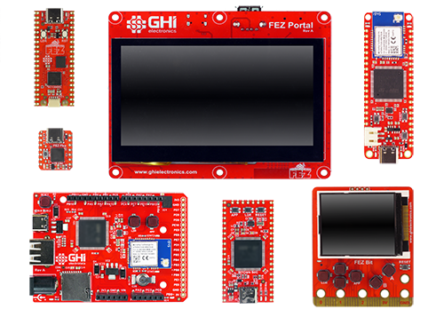
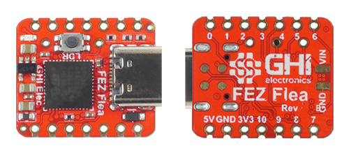
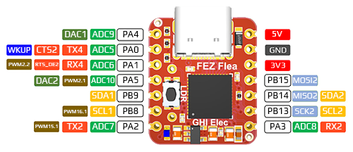
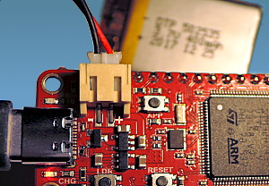
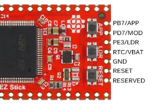
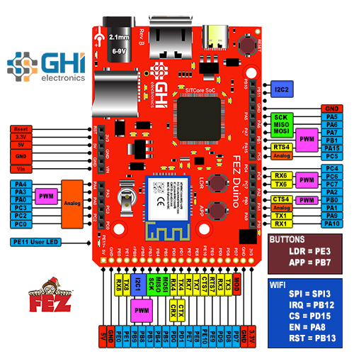

# Single Board Computers
---

We offer multiple single board computers to provide the lowest possible barrier to entering the world of TinyCLR OS. Most of these boards have WiFi and they all support the complete TinyCLR feature set. These boards are great for trying out TinyCLR OS, building prototypes, or incorporating into products.

## Specifications and Peripherals

|                        |                 |                |                 |                 |                 |                |                         |
|------------------------|-----------------|----------------|-----------------|-----------------|-----------------|----------------|-------------------------|
|                        | **FEZ Flea**    | **FEZ Pico**   | **FEZ Feather** | **FEZ Stick**   | **FEZ Bit**     | **Fez Duino**  | **Fez Portal**          | 
| **Core**               | SC13048Q        | SC13048Q       | SC20100S        | SC20100S        | SC20100S        | SC20100S       | SC20260N                | 
| **External SDRAM**     | X               | X              | X               | X               | X               | X              | 32 MByte                |
| **External Flash**     | X               | X              | X               | X               | X               | 16 MByte       | 16 MByte                |
| **Display**            | X               | X              | X               | X               | 1.8" 160x128    | X              | 4.3" 480x272 Cap. Touch |
| **Click Connectors**   | X               | X              | X               | 2               | X               | X              | 1                       |
| **WiFi**               | X               | X              | Yes             | X               | Yes             | Yes            | Yes                     |
| **Micro SD**           | X               | X              | X               | X               | Yes             | Yes            | Yes                     |
| **User LED**           | Yes             | Yes            | Yes             | Yes             | Yes             | Yes            | Yes                     |
| **Buzzer**             | X               | X              | X               | X               | Yes             | X              | Yes                     |
| **Accelerometer**      | X               | X              | X               | X               | Yes             | X              | X                       |
| **User Buttons**       | X               | X              | Yes             | Yes             | Yes             | Yes            | Yes                     |
| **USB Client**         | Yes             | Yes            | Yes             | Yes             | Yes             | Yes            | Yes                     |
| **USB Host Connector** | X               | X              | X               | Yes             | X               | Yes            | Yes                     |
| **LiPo Charger**       | X               | X              | Yes             | X               | X               | X              | X                       |
| **Power Barrel**       | X               | X              | X               | X               | X               | Yes            | X                       |
| **GPIO**               | 11              | 26             | 31              | 33              | 19              | 38             | 45                      |
| **SPI**                | 1               | 2              | 2               | 2               | 1               | 2              | 3                       |
| **I2C**                | 2               | 1              | 1               | 2               | 1               | 2              | 1                       |
| **UART**               | 3 (1 w/ HS)     | 3 (1 w/ HS)    | 5 (1 w/ HS)     | 2 (0 w/ HS)     | 3 (0 w/ HS)     | 5 (2 w/ HS)    | 6 (1 w/ HS)             |
| **CAN**                | X               | 1              | 1               | 1               | 1               | 1              | 2                       |
| **PWM**                | 4               | 7              | 8               | 6               | 8               | 12             | 17                      |
| **ADC**                | 6               | 6              | 6               | 3               | 8               | 11             | 10                      | 
| **DAC**                | 1               | 1              | 1               | X               | 1               | 2              | 2                       | 
| **SD/SDIP/MMC**        | X               | X              | 1               | 1               | 1               | 1              | 1                       | 

*Note: As many pins share peripherals, not all peripherals will be available.*

---

## Power Consumption
The 'Running' power consumption totals include all other on board components, such as WiFi & Display.

### FEZ Flea/Pico Power

|                       | 80MHz           | 40MHz           |          
|-----------------------|-----------------|-----------------|
| **Running**           | 12.6mA          | 7.5mA           |
| **Idle**              | 6.2mA           | 4.2mA           |
| **Sleep**             | 1.4mA           | 1.4mA           |
| **Shutdown**          | 23uA            | 23uA            |

### FEZ Duino/Stick/Feather Power

|                       | 480MHz          |   240MHz        |          
|-----------------------|-----------------|-----------------|
| **Running**           | 205mA           | 110mA           |
| **Idle**              | 170mA           | 97mA            |
| **Sleep**             | 6.5mA           | 6.5mA           |
| **Shutdown**          | 40uA            | 40uA            |

> [!Tip]
> Enabling WiFi (when available) adds up to 300mA. Battery charging on FEZ Feather adds up to 500mA.

### FEZ Bit Power

|                       | 480MHz          |   240MHz        |          
|-----------------------|-----------------|-----------------|
| **Running**           | 232mA           | 140mA           |
| **Idle**              | 190mA           | 127mA           |
| **Sleep**             | 8.5mA           | 8.5mA           |
| **Shutdown**          | 90uA            | 90uA            |

> [!Tip]
> Display backlight is included when Running and in Idle, but off in Sleep and Shutdown.

> [!Tip]
> Enabling WiFi adds up to 300mA.

### FEZ Portal Power

|                        | 480MHz          |   240MHz        |           
|------------------------|-----------------|-----------------|
| **Running**            | 375mA           | 345mA           |
| **Idle**               | 270mA           | 255mA           |
| **Sleep**              | 17mA            | 17mA            | 
| **Shutdown**           | 9.7mA           | 9.7mA           |

> [!Tip]
> Display backlight is included when Running and in Idle, but off in Sleep and Shutdown.

> [!Tip]
> Enabling WiFi adds up to 300mA.

See the [Power Management](http://docs.ghielectronics.com/software/tinyclr/tutorials/power-management.html) tutorial 

---

## USB-C Functionality

All SITCore single board computers use a USB-C connector for application deployment and debugging. While USB-C has many advantages, we've also noticed some flaws. Every USB-A to USB-C cable tested worked as expected. Testing USB-C to USB-C cables gave interesting and unexpected results. Most USB-C hubs also do not work when using USB-C to USB-C cables. If you are having problems deploying or debugging, try connecting the board directly to your computer with a USB-A to USB-C cable.

---

## FEZ Flea

The **FEZ Flea** is the most cost effective way to dive into TinyCLR OS. With it's Seeeduino Xiao form factor it can be used with many existing accessories on the market. The board also has castellated  and through-hole pins. Making it ideal for using as a SoM or on a breadboard.

[FEZ Flea Schematic](pdfs/fez-flea-rev-b-schematic.pdf)

[FEZ Flea STEP file](http://files.ghielectronics.com/downloads/3D/SITCore/SBC/FEZ%20Flea%20Rev%20B.step)

### FEZ Flea Peripheral Pin

|                   |             |
|-------------------|-------------|
| **User LED**      | PA8         |
|                   |             |
| **Button**        | LDR = PC13  |

---

## FEZ Pico

The **FEZ Pico** uses the Raspberry Pi Pico form factor allowing it drop into existing Pico accessories. The FEZ Pico adds JST connector compatible with Sparkfun Qwiic modules and Adafruit STEMMA modules. This allows for easy expandability.

[FEZ Pico Schematic](pdfs/fez-pico-rev-d-schematic.pdf)

[FEZ Pico STEP file](http://files.ghielectronics.com/downloads/3D/SITCore/SBC/FEZ%20Pico%20Rev%20D.step)

### FEZ Pico Peripheral Pin

|                   |             |
|-------------------|-------------|
| **User LED**      | PA8         |
|                   |             |
| **Button**        | LDR = PC13  |

---

## FEZ Feather

The Adafruit Feather form factor boards are made to be stackable and have built-in support for 3.7V LiPo batteries with a charging circuit. The **FEZ Feather** provides both through hole pads and castellated edges making it both breadboard friendly and easy to build into products.

>[!Caution]
>Lithium Polymoer(Li-Po) batteries are significantly more volatile than other rechargable batteries. Make sure you have an understanding of how to properly charge and use them before connecting to the FEZ Feather. Never attempt to charge a damaged or swollen battery. Never leave battery charging unattended. Improper use could result in fire.

>[!Warning]
>Be very careful to ensure the correct polarity of LiPo batteries before connecting them to the FEZ Feather. Reverse polarity will damage the charging circuit, and not all batteries are wired correctly. GHI Electronics is not responsible for, and will not warranty, damage caused by incorrectly connected batteries.

Make sure the battery polarity is correct as shown below (red wire to plus, black to minus):

>[!Caution]
>The 3.3v regulator may run hot, especially when WiFi is in use. You can add 3.3V regulator externally to eliminate this heat issue, and this is needed if adding any external components that draw more than 10mA.

[FEZ Feather Schematic](pdfs/fez-feather-rev-b-schematic.pdf)

[FEZ Feather 3D STEP File](http://files.ghielectronics.com/downloads/3D/SITCore/SBC/FEZ%20Feather%20Rev%20B.step)

### FEZ Feather Peripheral Pins

|                   |             |
|-------------------|-------------|
| **User LED**      | PE11        |
|                   |             |
| **WiFi**          | SPI = SPI3  |
|                   | IRQ = PB12  |
|                   | CS = PD15   |
|                   | EN = PA8    |
|                   | RST = PB13  |
|                   |             |
| **Buttons**       | LDR = PE3   |
|                   | APP = PB7   |

---

## FEZ Stick

The **FEZ Stick** is a cost effective way to easily get started with TinyCLR OS. While providing an inexpensive way for the uninitiated to try TinyCLR OS, we've provided castellated edges as well as through hole pads to make it breadboard friendly and easy to embed into products. Also, there's actually space for two click modules, making this a very versatile board at a very affordable price!

> [!Note]
> FEZ Stick REV. B pin PB13 MISO is mislabeled on the silk screen and should read PE13 MISO

>[!Caution]
>The onboard 3.3v regulator is only capable of running external components of an additional 50mA. If more current is necessary, then add an additional external 3.3V regulator.

[FEZ Stick Schematic](pdfs/fez-stick-rev-b-schematic.pdf)

[FEZ Stick 3D STEP File](http://files.ghielectronics.com/downloads/3D/SITCore/SBC/FEZ%20Stick%20Rev%20B.step)

### FEZ Stick Peripheral Pins

|                   |             |
|-------------------|-------------|
| **User LED**      | PE11        |
|                   |             |
| **Buttons**       | LDR = PE3   |
|                   | APP = PB7   |

---

## FEZ Bit

The **FEZ Bit**, while seemingly more of a "maker" board, provides a convenient way to easily use the multitude of inexpensive Micro:bit accessories that have flooded the market. As the number of Micro:bit accessories continues to grow, this board will be valued as a way to use these accessories to quickly assemble prototypes and test new product concepts.

>[!Caution]
>The 3.3v regulator may run hot, especially when WiFi is in use. You can add 3.3V regulator externally to eliminate this heat issue, and this is needed if adding any external components that draw more than 10mA.

[FEZ Bit Schematic](pdfs/fez-bit-rev-b-schematic.pdf)

[FEZ Bit 3D STEP File](http://files.ghielectronics.com/downloads/3D/SITCore/SBC/FEZ%20Bit%20Rev%20B.step)

### FEZ Bit Peripheral Pins

|                   |             |
|-------------------|-------------|
| **User LED**      | PE11        |
|                   |             |
| **Buzzer**        | PB1         |
|                   |             |
| **Accelerometer** | I2C = I2C1  |
|                   |             |
| **SPI Display**   | SPI = SPI4  |
|                   | BL = PA15   |
|                   | CS = PD10   |
|                   | RS = PC4    |
|                   | RST = PE15  |
|                   |             |
| **WiFi**          | SPI = SPI3  |
|                   | IRQ = PB12  |
|                   | CS = PD15   |
|                   | EN = PA8    |
|                   | RST = PB13  |
|                   |             |
| **Buttons**       | LDR = PE3   |
|                   | APP = PB7   |
|                   | UP = PE4    |  
|                   | DOWN = PA1  |
|                   | A = PE5     |
|                   | B = PE6     |
|                   |             |
| **Edge Connector**| P0 = PC6 (PC2 Analog)|
|                   | P1 = PC7 (PA3 Analog)|
|                   | P2 = PA0    |
|                   | P3 = PB0    |
|                   | P4 = PA4    |
|                   | P5 = PD13   |
|                   | P6 = PD12   |
|                   | P7 = PD11   |
|                   | P8 = PE8    |
|                   | P9 = PC3    |
|                   | P10 = PC0   |
|                   | P11 = PD1   |
|                   | P12 = PD0   |
|                   | P13 = PA5   |
|                   | P14 = PA6   |
|                   | P15 = PA7   |
|                   | P16 = PE7   |
|                   | P19 = PB8   |
|                   | P20 = PB9   |

> [!Note]
> All boards with a barrel power jack accept a 5.5 x 2.1 mm power plug. The pin is positive, the sleeve is negative. While these boards accept a wide voltage range, they use linear voltage regulators that run hotter with higher input voltages. Generally we recommend an input voltage of 6 to 12 volts, but if your project draws a lot of current, use a lower voltage to keep the regulator cooler. A one amp power supply should provide enough current for most needs.

---

## FEZ Duino

The **FEZ Duino** provides female headers that make use of the popular Arduino pinout. Once again, we are trying to make it as easy and inexpensive as possible to build prototypes and try out new concepts by taking advantage of an existing accessory ecosystem.

[FEZ Duino Schematic](pdfs/fez-duino-rev-b-schematic.pdf)

[FEZ Duino 3D STEP File](http://files.ghielectronics.com/downloads/3D/SITCore/SBC/FEZ%20Duino%20Rev%20B.step)

### FEZ Duino Peripheral Pins

|                   |             |
|-------------------|-------------|
| **User LED**      | PE11        |
|                   |             |
| **WiFi**          | SPI = SPI3  |
|                   | IRQ = PB12  |
|                   | CS = PD15   |
|                   | EN = PA8    |
|                   | RST = PB13  |
|                   |             |
| **Buttons**       | LDR = PE3   |
|                   | APP = PB7   |

> [!Warning]
> FEZ Duino REV. A & B, The cap used on barrel jack is 6.3v but the input voltage can be as high as 12v. Use the barrel jack at your own risk or replace cap with a higher voltage. This only effects the power barrel jack. Everything else functions as expected if using USB for power.

---

## FEZ Portal

Already one of our most popular SITCore single board computers, The **FEZ Portal** is a 4.3" 480x272 display with capacitive touch that is programmable in C#. As the display and controller are one unit, it's even easier to make a product with touch as you only have to mount a single board that's only slightly larger than the display. Display uses part# ER-TFT043-3 available at [buydisplay.com](https://www.buydisplay.com/) 

> [!Note]
> I2C address on touch screen controller is 0x38. Use software I2C if a device has same address need to be connected.

[FEZ Portal Schematic](pdfs/fez-portal-rev-c-schematic.pdf)

[FEZ Portal 3D STEP File](http://files.ghielectronics.com/downloads/3D/SITCore/SBC/FEZ%20Portal%20Rev%20C.step)

### FEZ Portal Peripheral Pins

|                   |                 			|
|-------------------|---------------------------|
| **User LED**      | PB0             			|
|                   |                 			|
| **Buzzer**        | PB1             			|
|                   |                 			|
| **Display**       | BL = PA15       			|
|                   | Touch I2C = I2C1			|
|                   | Touch I2C Address = 0x38 	|
|                   | Touch IRQ = PG9 			|
|                   |                 			|
| **WiFi**          | SPI = SPI3      			|
|                   | IRQ = PF10      			|
|                   | CS = PA6        			|
|                   | EN = PA8        			|
|                   | RST = PC3       			|
|                   |                 			|
| **Buttons**       | LDR = PE3       			|
|                   | APP = PB7       			|

---
