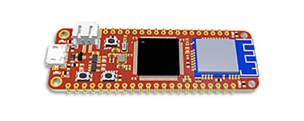

# Single Board Computers
---

We offer multiple single board computers to provide the lowest possible barrier to entering the world of TinyCLR OS. Most of these boards have WiFi and they all support the complete TinyCLR feature set. These boards are great for trying out TinyCLR OS, building prototypes, or incorporating into products.

|                        |              |               |                 |                         |               |
|------------------------|--------------|---------------|-----------------|-------------------------|---------------|
|                        | **FEZ Bit**  | **Fez Duino** | **FEZ Feather** | **Fez Portal**          | **FEZ Stick** |
| **Core**               | SC20100S     | SC20100S      | SC20100S        | SC20260N                | SC20100S      |
| **Display**            | 1.8" 160x128 | X             | X               | 4.3" 480x272 Cap. Touch | X             |
| **Click Connectors**   | X            | X             | X               | 1                       | 2             |
| **WiFi**               | Yes          | Yes           | Yes             | Yes                     | X             |
| **Micro SD**           | Yes          | Yes           | X               | Yes                     | Yes           |
| **User LED**           | Yes          | Yes           | Yes             | Yes                     | Yes           |
| **Buzzer**             | Yes          | X             | X               | Yes                     | Yes           |
| **Accelerometer**      | Yes          | X             | X               | X                       | X             |
| **User Buttons**       | Yes          | Yes           | Yes             | Yes                     | Yes           |
| **USB Client**         | Yes          | Yes           | Yes             | Yes                     | Yes           |
| **USB Host Connector** | X            | Yes           | X               | Yes                     | Yes           |
| **QSPI**               | ?            | X             | ?               | Yes                     | ?             |
| **LiPo Connector**     | X            | X             | Yes             | X                       | X             |
| **Power Barrel**       | X            | Yes           | X               | X                       | X             |

## FEZ Bit

The FEZ Bit, while seemingly more of a "maker" board, provides a convenient way to easily use the multitude of inexpensive Micro:bit accessories that have flooded the market. As the number of Micro:bit accessories continues to grow, this board will be valued as a way to use these accessories to quickly assemble prototypes and test new product concepts.

## FEZ Duino

The FEZ Duino provides female headers that make use of the popular Arduino pinout. Once again, we are trying to make it as easy and inexpensive as possible to build prototypes and try out new concepts by taking advantage of an existing accessory ecosystem.

## FEZ Feather

The Adafruit Feather form factor boards are made to be stackable and have built in support for LiPo batteries, including a charging circuit. We've watched this form factor quickly gaining popularity, so we decided to make a Feather board of our own. If your project needs to run off of a battery, this board makes it quick and easy to get started. The FEZ Feather provides both through hole pads and castellated edges making it both breadboard friendly and easy to build into products.

## FEZ Portal

Already one of our most popular SITCore single board computers, The FEZ Portal is a 4.3" 480x272 display with capacitive touch that is programmable in C#. As the display and controller are one unit, it's even easier to make a product with touch as you only have to mount a single board that's only slightly larger than the display.

## FEZ Stick

The FEZ Stick is simply the least expensive way to easily get started with TinyCLR OS. While providing an inexpensive way for the uninitiated to try TinyCLR OS, we've provided castellated edges as well as through hole pads to make it breadboard friendly and easy to embed into products. Also, there's actually space for two click modules, making this one very versatile board for the price!

