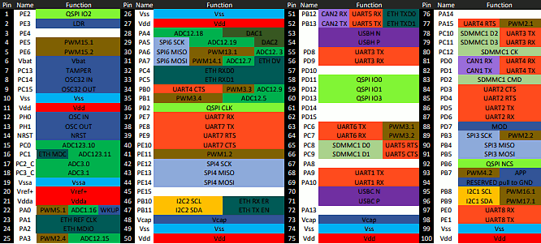
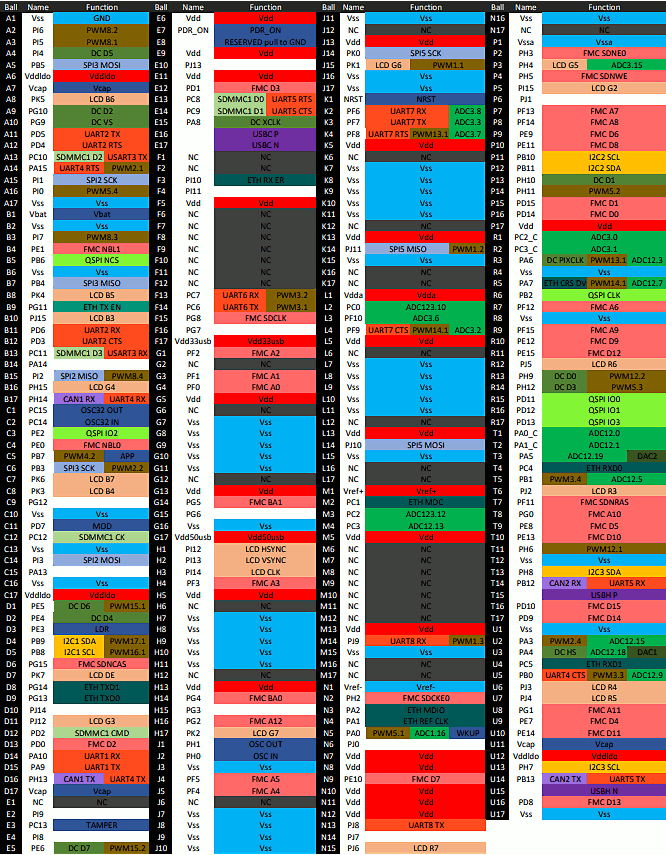
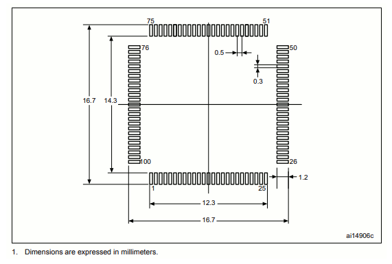

# SITCore System on Chip
---

## Overview
The SITCore SoCs provide a low cost way to add .NET computing power to any embedded product. Available as either a 100 pin LQFP or a 265 ball BGA, the SITCore SoCs let you design IoT products that are secure, easily integrated with the cloud, and can be easily managed and updated from the cloud for deployments of one to a million or more.

## Specifications

| Spec                   | SC20100S                  | SC20260B             |
|------------------------|---------------------------|----------------------|
| **Core**               | ARM Cortex-M7 32 bit      | ARM Cortex-M7 32 bit |
| **Speed**              | 480 MHz                   | 480 MHz              |
| **Internal RAM**       | 1 MByte                   | 1 MByte              |
| **Internal Flash**     | 2 MByte                   | 2 MByte              |
| **Instruction Cache**  | 16 KByte                  | 16 KByte             |
| **Data Cache**         | 16 KByte                  | 16 KByte             |
| **Package**            | LQFP100 14 x 14 mm        | 265-TFBGA 14 x 14 mm |
| **Temperature Range**  | -40C to +85C              | -40C to +85C         |

*Note: Resources are shared between your application and the operating system.*

## Peripherals

| Peripheral                 | SC20100S                  | SC20260B              |
|----------------------------|---------------------------|-----------------------|
| **GPIO**                   | 76                        | 164                   |
| **SPI**                    | 3                         | 3                     |
| **I2C**                    | 2                         | 3                     |
| **UART**                   | 8 (4 with handshaking)    | 8 (4 with handshaking)|
| **CAN**                    | 2                         | 2                     |
| **PWM**                    | 16                        | 29                    |
| **ADC**                    | 12                        | 21                    |
| **DAC**                    | 2                         | 2                     |
| **SD/SDIP/MMC**            | 1                         | 1                     |
| **Quad SPI**               | 1                         | 1                     |
| **USB Host**               | 1                         | 1                     |
| **USB Client**             | 1                         | 1                     |
| **Ethernet**               | 1                         | 1                     |
| **LCD TFT**                | 0                         | 1                     |
| **Camera**                 | 0                         | 1                     |

*Note: As many pins share peripherals, not all peripherals will be available.*

### Using Interrupts (IRQs)

The microcontrollers we use in our SITCore line of products do not support concurrent interrupts with the same pin number, even if the pins are on different ports (the port is denoted by the second letter of the GPIO pin name -- PA1 is pin 1 on port A). Therefore, interrupts are available on only 16 pins at any given time. For example, pins PA1 and PB1 cannot be used as interrupt pins at the same time, but PA1 and PB2 can. PA1 and PA2 can also be used with interrupts simultaneously.

## Features

* Low power modes including three independently controllable power domains
* RTC
* Watchdog
* Threading
* TCP/IP with SSL
  * Full .NET socket interface
  * Ethernet
  * PPP
* Graphics
  * Images
  * Fonts
  * Controls
* File System
  * Full .NET file interface
  * SD cards
  * USB drives
* Native extensions
  * Runtime Loadable Procedures
  * Device register access
* Signal controls
  * Generation
  * Capture
  * Pulse measurement
    
## Pinouts

### SC20100S Pinout

### SC20260B Pinout

## Device Startup
The SITCore is held in reset while the RESET pin is low. Releasing RESET will begin the system startup process.

There are three different components of the device firmware:
1. GHI Electronics Bootloader: initializes the system, updates TinyCLR when needed, and executes TinyCLR.
2. TinyCLR: used to load, debug, and execute the managed application.
3. Managed application: the program developed by you or your software developer.

Which components get executed on startup is controlled by manipulating the LDR pin. It is pulled high on startup during normal program execution. When low, the device waits in the GHI Electronics Bootloader. Otherwise, the managed application is executed. The APP pin is used to stop the application from running.

Additionally, the communications interface between the host PC and the SITCore is selected on startup through the MOD pin, which is pulled high on startup. The USB interface is selected when MOD is high and COM1 is selected when MOD is low.

The above discussed functions of the LDR, APP, and MOD pins are only available during startup. After startup, the pins return to the default GPIO state and are available as a GPIO (or peripheral pin) in your application. Check out the [Special Pins](../../software/tinyclr/special-pins.md) page for more information.

## TinyCLR OS
TinyCLR OS provides a way to program the SITCore in C# or Visual Basic from the Microsoft Visual Studio integrated development environment.  To get started you must first install the firmware on the SITCore (instructions below) and then go to the TinyCLR [Getting Started](../../software/tinyclr/getting-started.md) page for instructions.

### Loading the Firmware

1. Activate the bootloader, hold the LDR signal low while resetting the board.
2. Open [TinyCLR Config](../../software/tinyclr/tinyclr-config.md) tool.
3. Click the loader tab.
4. Select the correct COM port. If you are not seeing it then the device is not in the loader mode.
5. Click the `Update to Latest` button.

You can also update the firmware manually. Download the [firmware](../../software/tinyclr/downloads.md) and learn how to use the [GHI Electronics Bootloader](../../software/tinyclr/bootloader.md) manually

### Start Coding
Now that you have installed the bootloader and firmware on the SITCore, you can setup your host computer and start programming.  Go to the TinyCLR [Getting Started](../../software/tinyclr/getting-started.md) page for instructions.

## Design Considerations

### Footprints
####This is the recommended footprint for the SC20100S:

####This is the recommended footprint and PCB design rules for the SC20260B:

### Required Pins
Exposing the following pins is required in every design to enable device programming, updates, and recovery:
* RESET
* LDR
* APP
* MOD (if required to select a debug interface)
* Desired debug interface(s)

For information on these and other important pins, please refer to the [Special Pins](../../software/tinyclr/special-pins.md) page.

### Power Supply
A clean power source, suitable for digital circuitry, is needed to power SITCore SoCs. Voltages should be regulated to within 10% or better of the specified voltage. Decoupling capacitors of 0.1 uF are needed near every power pin. Additionally, a large capacitor, typically 47 uF, should be placed near the SoC if the power supply is more than few inches away.

### Analog Considerations
It is a good idea to provide a separate filtered supply line for the `Vdda`, and `Vref+` pins. Additionally, on the 260 pin devices, you may want to provide a separate filtered ground connection for the `Vssa` and `Vref-` pins. While this is not needed for ADC operation, it does help to ensure more accurate ADC readings by reducing analog supply noise.

### Crystals
The SITCore requires an external 8 MHz crystal and associated circuitry to function. For the RTC to function, a 32.768
kHz crystal and circuitry are required. Please see the processor's documentation for advanced information.

### Reset
The reset pin is not pulled in any direction. Designs must be sure to use an appropriate pull-up resistor.

### Oven Reflow Profile

SITCore SoCs are not sealed for moisture. Baking SoCs before reflow is recommended and required in a humid environment. The process of reflow can damage the SoC if the temperature is too high or exposure is too long.

The lead-free reflow profiles used by GHI Electronics are shown below. The profiles are based on AIM SAC 305 solder (3% silver, 0.5% copper). The thermal mass of the assembled board and the sensitivity of the components on it affect the total dwell time. Differences in the two profiles are where they reach their respective peak temperatures as well as the time above liquids (TAL). The shorter profile applies to smaller assemblies, whereas the longer profile applies to larger assemblies such as back-planes or high-density boards. The process window is described by the shaded area. These profiles are only starting-points and general guidance. The particulars of the oven and the assembly will determine the final process.

## SITCore Dev Boards

We offer SITCore development boards to get you started as quickly and easily as possible. These boards allow you to start programming in minutes, and are suitable for both prototypes and production. Click [here](dev.md) for details.
