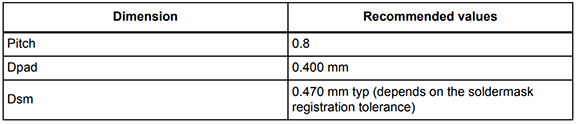

# SITCore System on Chip
---

## Overview
The SITCore SoCs provide a low cost way to add .NET computing power to any embedded product. Available as either a 100 pin LQFP or a 265 ball BGA, the SITCore SoCs let you design IoT products that are secure, easily integrated with the cloud, and can be easily managed and updated from the cloud for deployments of one to a million or more.

## Ordering Part Number
* 100 Pin LQFP: SC20100S
* 100 Ball BGA: SC20100B
* 265 Ball BGA: SC20260B

## Specifications

| Spec               | SC20100x                  | SC20260B             |
|--------------------|---------------------------|----------------------|
| Processor          | STM32H743VIT6             | STM32H743XIH6        |
| Core               | ARM Cortex-M7 32 bit      | ARM Cortex-M7 32 bit |
| Speed              | 480 MHz                   | 480 MHz              |
| Internal RAM       | 1 MByte                   | 1 MByte              |
| Internal Flash     | 2 MByte                   | 2 MByte              |
| Instruction Cache  | 16 KByte                  | 16 KByte             |
| Data Cache         | 16 KByte                  | 16 KByte             |
| Package            | LQFP100 14 x 14 mm        | 265-TFBGA 14 x 14 mm |
| Temperature Range  | -40C to +85C              | -40C to +85C         |

*Note: Resources are shared between your application and the operating system.*

## Peripherals

| Peripheral            | SC20100                   | SC20260               |
|-----------------------|---------------------------|-----------------------|
| GPIO (all support IRQ)|                           |                       |
| SPI                   | 4                         | 3                     |
| I2C                   | 3                         | 3                     |
| UART/USART            | 8 (4 with handshaking)    | 8 (4 with handshaking)|
| CAN                   | 2                         | 2                     |
| PWM                   | 19                        | 27                    |
| ADC                   | 11                        | 21                    |
| DAC                   | 2                         | 2                     |
| SD/SDIP/MMC           | 1                         | 1                     |
| Quad SPI              | 1                         | 1                     |
| USB Host              | 1                         | 1                     |
| USB Client            | 1                         | 1                     |
| Ethernet              | 1                         | 1                     |
| LCD TFT               | 0                         | 1                     |
| Camera                | 0                         | 1                     |

*Note: As many pins share peripherals, not all peripherals will be available.*

## Features

* Low power modes including three independently controllable power domains
* RTC
* Watchdog
* Threading
* TCP/IP with SSL
  * Full .NET socket interface
  * Ethernet
  * PPP
* Graphics
  * Images
  * Fonts
  * Controls
* File System
  * Full .NET file interface
  * SD cards
  * USB drives
* Native extensions
  * Runtime Loadable Procedures
  * Device register access
* Signal controls
  * Generation
  * Capture
  * Pulse measurement
    
## Pinout

## Device Startup
The SITCore is held in reset when the reset pin is low. Releasing it will begin the system startup process.

There are three different components of the device firmware:
1. GHI Bootloader: Initializes the system, updates TinyCLR when needed, and executes TinyCLR.
2. TinyCLR: loads, debugs, and executes the managed application.
3. Managed application: the program developed by the customer.

Which components get executed on startup can be control by manipulating the LDR0 pin. It is pulled high on
startup. When low, the device waits in the GHI Bootloader. Otherwise, the managed application is executed. LDR1
is reserved for future use.

Additionally, the communications interface between the host PC and the SITCore is selected on startup through the
MODE pin, which is pulled high on startup. The USB interface is selected when MODE is high and COM1 is selected
when MODE is low.

The above discussed functions of LDR0, LDR1, and MODE are only during startup. After startup, they return to the
default GPIO state and are available to use as GPIO in the user application

## TinyCLR OS
TinyCLR OS provides a way to program the SITCore in C# or Visual Basic from the Microsoft Visual Studio integrated development environment.  To get started you must first install the firmware on the SITCore (instructions below) and then go to the TinyCLR [Getting Started](../../software/tinyclr/getting-started.md) page for instructions.

### Loading the Firmware

1. Activate the bootloader, hold the LDR0 signal low while resetting the board.
2. Open [TinyCLR Config](../../software/tinyclr/tinyclr-config.md) tool.
3. Click the loader tab.
4. Select the correct COM port. If you are not seeing it then the device is not in the loader mode.
5. Click the `Update to Latest` button.

You can also update the firmware manually. Download the [firmware](../../software/tinyclr/downloads.md) and learn how to use the [GHI Bootloader](../../hardware/loaders/ghi-bootloader.md) manually

### Loading the Bootloader
1. Download the SITCore bootloader [here](../../hardware/loaders/ghi-bootloader.md).
2. Connect your device to the USB client port.
3. Put the board in DFU mode: Hold the SYS A pin low and press/release the reset button. Wait for a second then release SYS A. Windows *Device Manager* will now show "STM Device in DFU Mode" under the 'Universal Serial Bus controller' TAB.
4. Go to the [STM32 Bootloader](../../hardware/loaders/stm32-bootloader.md) to learn how to upload DFU files.

### Loading the Firmware
1. Activate the bootloader, hold the LDR0 signal (SYS B) low while resetting the board.
2. Open [TinyCLR Config](../../software/tinyclr/tinyclr-config.md) tool.
3. Click the loader tab.
4. Select the correct COM port. If you are not seeing it then the device is not in the loader mode.
5. Click the `Update to Latest` button.

You can also update the firmware manually. Download the [firmware](../../software/tinyclr/downloads.md) and learn how to use the [GHI Bootloader](../../hardware/loaders/ghi-bootloader.md) manually.

### Start Coding
Now that you have installed the bootloader and firmware on the SITCore, you can setup your host computer and start programming.  Go to the TinyCLR [Getting Started](../../software/tinyclr/getting-started.md) page for instructions.

## Datasheet

## Design Considerations

### Footprints
####This is the recommened footprint for the SC20100S:

####This is the recommended footprint and PCB design rules for the SC20100B:

####This is the recommended footprint and PCB design rules for the SC20260B:

### Required Pins
Exposing the following pins is required in every design to enable device programming, updates, and recovery:
* LDR
* APP
* RESET
* MOD (if required to select a debug interface)

### Power Supply
A typical clean power source, suited for digital circuitry, is needed to power the SITCore SoCs. Voltages should be within at
least 10% of the specified voltage. Decoupling capacitors of 0.1 uF are needed near every power pin. Additionally, a
large capacitor, typically 47 uF, should be near the G80 if the power supply is more than few inches away.

### Crystals
The SITCore requires an external 8 MHz crystal and associated circuitry to function. For the RTC to function, a 32.768
kHz crystal and circuitry are required. Please see the processor's documentation for advanced information.

### Reset
The reset pin is not pulled in any direction. Designs must be sure to use an appropriate pull-up resistor.

### Oven Reflow Profile

## SITCore Development Board
