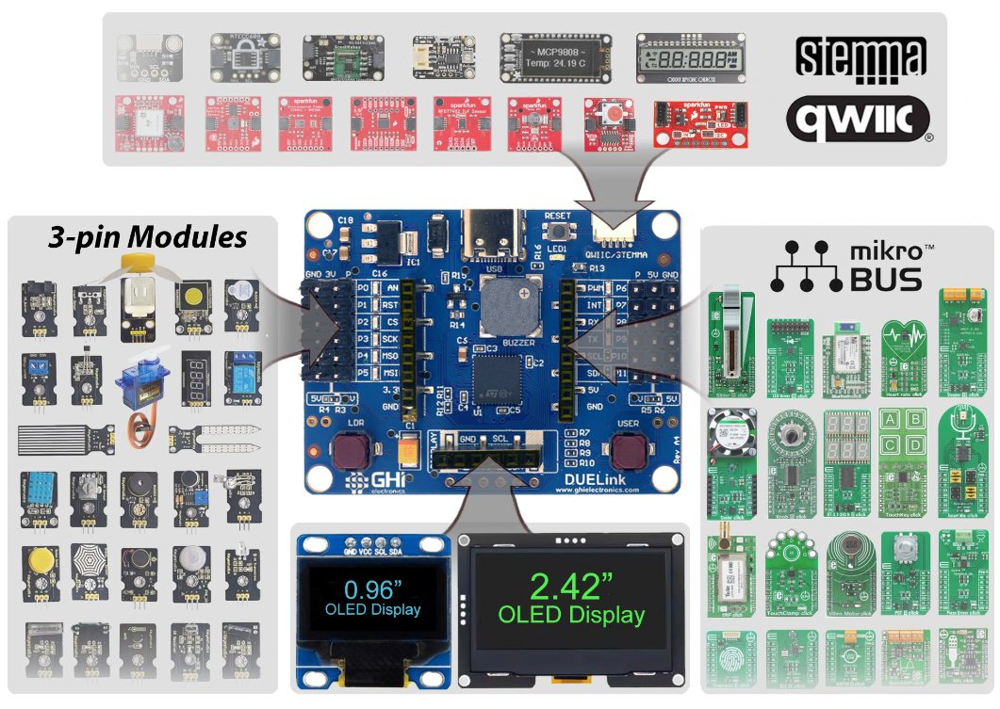

# DUELink Spider

---

With DUELink Spider, you can effortlessly connect thousands of electronic sensors and modules directly to the board. Say goodbye to intimidating loose wires and soldering – just plug and play!

- [3-pin Modules](threepin.md): These low-cost modules are available everywhere, including Amazon and Temu. (Light sensor, relay, servo motor...)
- [Qwiic/STEMMA](qwiic.md): SparkFun and Adafruit offer these friendly modules that are chainable through a very tiny connector. (Joystick, LEDs, Accelerometer...)
- [mikroBus](click.md): MikroElectronika offers over a thousand modules that range from simple to complex and simply plug into DUELink . (FM Radio, Oximeter, GPS...)
- [Displays](display.md): Several display options can be wired to the available I2C or SPI interfaces. (OLED, e-Ink, Color...)
- [Smart LEDs](led.md): Elevate your project by easily wiring smart LEDs that come in many shapes and forms. (Ropes, Wires, Matrix...)
