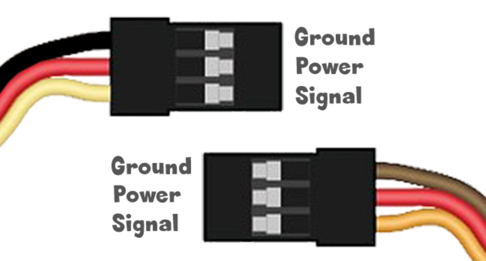

# 3-pin Modules

---

These modules are very low-cost and made by thousands of companies globally.

The pinout of the three pins is the same one used by the extremely common RC Servo Motors. While the wire coloring may differ, power is always in the middle. It is usually red color. The ground pin is on one of the sides and it is usually black or brown. The signal is the last wire and it is usually yellow or orange.

Depending on the module being used, the signal can be an input or an output, and it can be analog or digital. Some of these modules use data bus for transferring data. Here are a few examples.
 

 | Signal | Examples
 |--- |---
 | Digital Out	| Simple LED, Relay, Solenoid
 | Digital In	| Button, Motion
 | Analog Out	| Brushed Motor, Simple LED
 | Analog In	| Light, Temperature, Joystick
 | Data Bus		| Smart LEDs, Servo Motor, Smart Temp sensor

