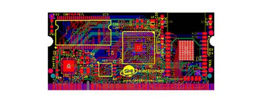
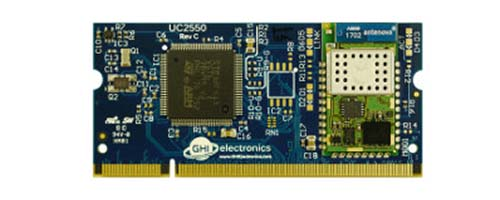
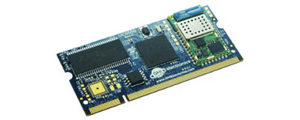
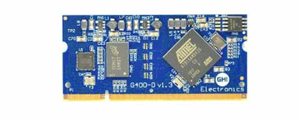

# Universal Compute Modules
---
> [!IMPORTANT]
> Continuing with our longevity policy, these modules are available for purchase; however, due to discontinued components by STMicroelectronics, they are no longer recommended. Consider [upgrading](../netmf/upgrade.md)

Universal Compute Modules are based on a 200 pin SO-DIMM form factor.  All models follow a standard pin out making it easy to change modules to fit the needs of your product.

A variety of tools and software options are available. Check the individual product documentation for details.

---
## UCM Standard
 

Description, peripherals and pinouts of the standard. 
  [**Learn more...**](standard.md) 

---
## UC2550
 

ARM Cortex-M4 based UCM with optional Wi-Fi.   [**Learn more...**](uc2550.md)

---
## UC5500

ARM Cortex-M7 based UCM with optional Wi-Fi.   [**Learn more...**](uc5550.md) 

---
## G400D

Based on a 400 MHz Atmel ARM 926.   [**Learn more...**](../netmf/g400d.md) 

---
## UCM Development Options

Development boards, breakout boards, displays.   [**Learn more...**](development-options.md) 

---

You can also visit our main website at [**main website**](http://www.ghielectronics.com) and our  [**community forum**](https://forums.ghielectronics.com/).
