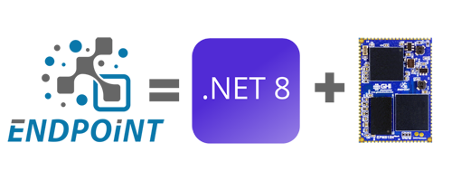

# GHI Electronics Documentation

---

Here you will find GHI Electronics product documentation. For more information visit the [**main website**](http://www.ghielectronics.com). You can also visit our [**community forum**](https://forums.ghielectronics.com).

---
## Endpoint - .NET 8 on Hardware

Endpoint is FULL .NET 8 for circuits! Load and run applications on embedded hardware.
  [**Learn More...**](endpoint/intro.md) 

---

## SITCore - Secure C# Hardware

 
 SITCore family of Secure C# Chips and Modules for creating secure IoT devices.   [**Learn More...**](hardware/sitcore/intro.md) 

---

## TinyCLR OS - the heart of SITCore

 
TinyCLR OS is the operating system for embedded devices, powering the SITCore product family. Develop software in Microsoft Visual Studio, and debug over USB.   [**Learn More...**](software/tinyclr/intro.md) 

