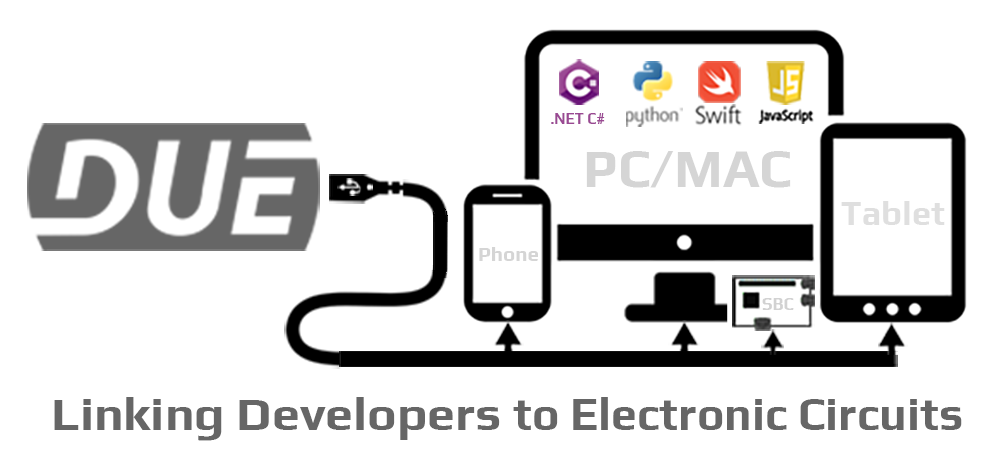

## What is DUE?

DUE is a Dynamic, Universal, and Extensible platform that links devices to the physical world. These devices can be desktops, laptops, phones, or even a Raspberry PI. Developers have the option to use any modern operating system and use the programming language of their choice.

---

## Continuous Innovation

[GHI Electronics](https://www.ghielectronics.com/)  has been bridging the hardware-to-software gap since 2003 with modern platforms,devices,systems, and coding languages. [GHI Electronics](https://www.ghielectronics.com/)  is yet again bringing you an new innovation to make physical computing accessible to everyone. Not just the hardware developer.

> [!Video https://www.youtube.com/embed/ojJmKfdOpAI]

