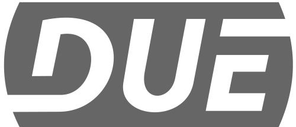

<!---

 

-->

## What is DUE?
DUE is a Dynamic, Universal, and Extensible platform that gives devices access to the physical world. These devices can be desktops, laptops, phones, or even a Raspberry pi. Developers have the option to use any modern operating system and use the programming language of their choice.

---
<!---

 

-->

## DUE is passed due!

GHI Electronics has been bridging the hardware-to-software gap since 2003 with modern platforms,devices,systems, and coding languages. GHI Electronics is yet again bringing you an new innovation to make physical computing accessible to everyone. Not just the hardware developer.

[GHI Electronics](https://www.ghielectronics.com/) is where hardware meets software!

