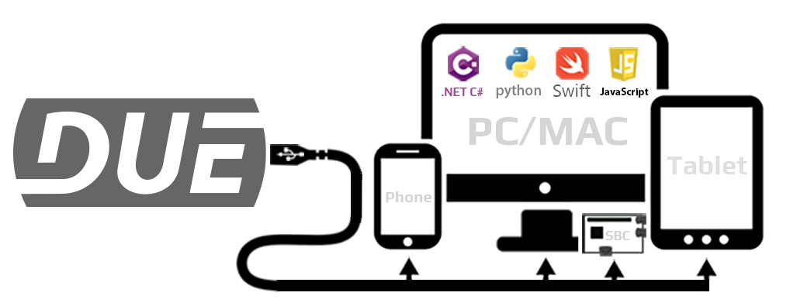
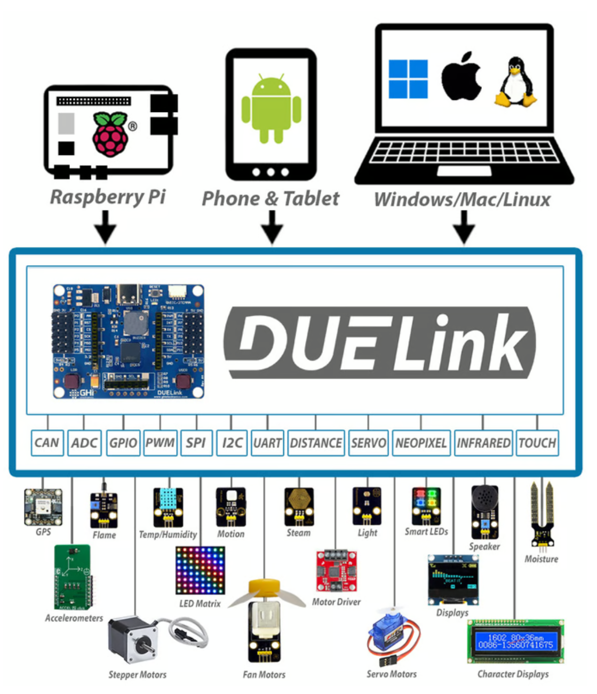
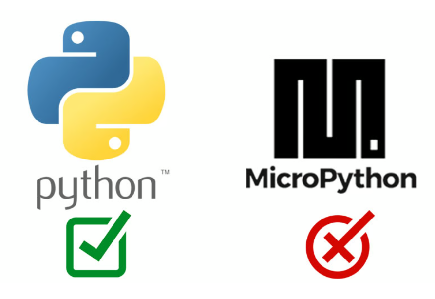
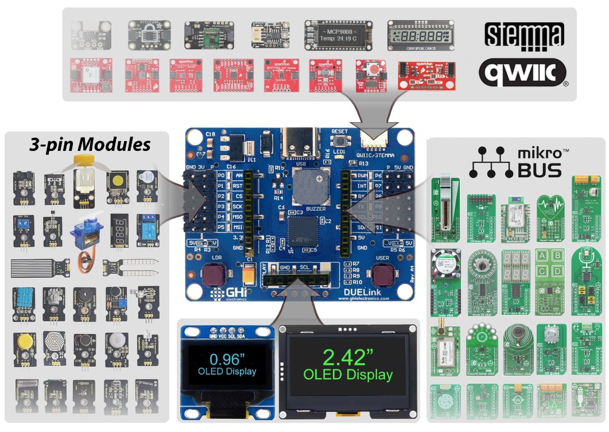
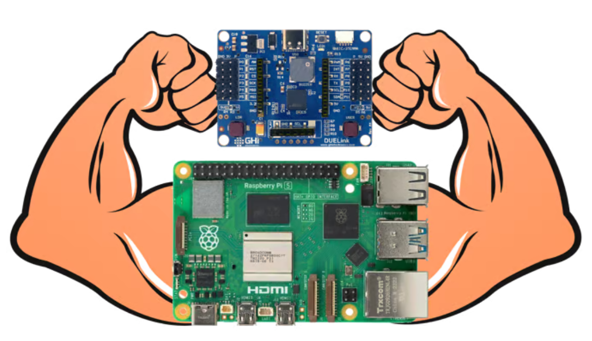

## You're DUE for something NEW!

Leverage your coding skills to code things right from a PC, a phone, or even a Raspberry Pi! Read sensors and control motors using Python and other languages - no hardware experience is necessary.

A DUELink board bridges your host (computer/phone...etc.) to thousands of electronic sensors and modules. This allows for an easy hardware connections.

Say goodbye to intimidating loose wires and soldering - just plug-and-play!

---
## How does it work?

DUELink Spider leverages the computing power and connectivity of your host device. This includes Raspberry Pi, Phones, Tablets, and PC/MAC/Linux.

The DUELink Spider is not a programmable microcontroller, but a peripheral for the host device.  

This approach allows you to run full Python scripts, utilize JavaScript pages, tackle processor-intensive AI projects, and dive into big data analytics with ease - now with a physical element.    

You do not need to learn microcontrollers and you do not need to settle with MicroPython. Go ahead and enjoy your favorite machine, with your favorite coding language!  

---
## Extensible Language Options

While Python is the main supported language, DUELink Spider works beautifully with JavaScript pages, .NET C# projects, and more.

---
## Hardware options

DUELink Spider is the bridge that allows you to effortlessly connect thousands of electronic sensors and modules to your PC/Phone/RPI - just plug and play!

---

## Add "Physical Strength" to your RPI

Some seemingly impossible physical computing tasks become easily accessible through DUELink Spider.

Let your Raspberry Pi do the heavy computational lifting to handle AI and other processor intensive tasks while utilizing DUELink Spider to handle the physical computing elements such as: controlling addressable Smart LEDs, reading physical sensors (distance, light, temp), and controlling multiple motors. 

This perfect marriage works on other single board computers, laptops, and phones!

---

## Continuous Innovation

[GHI Electronics](https://www.ghielectronics.com/) has been bridging the hardware-to-software gap for over 20 years. Our Michigan, USA headquarters is the center of our innovative engineering and quality manufacturing.

**We are Where Hardware Meets Software!**

> [!Video https://www.youtube.com/embed/ojJmKfdOpAI]

