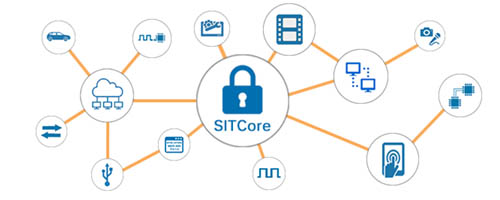

# GHI Electronics Documentation
---

Here you will find GHI Electronics product documentation. For more information visit the main website at [**www.ghielectronics.com**](http://www.ghielectronics.com). You can also visit our community forums at [**forums.ghielectronics.com**](https://forums.ghielectronics.com).

|  |  |
|---|---|
| **Hardware**   SITCore Chips, Modules, and Dev Boards are optimized for the development and production of highly secure IoT devices. [**Learn More...**](hardware/intro.md) | **TinyCLR OS**   TinyCLR lets you run .NET securely on embedded devices, develop software in Microsoft Visual Studio, and debug over USB. [**Learn More...**](software/tinyclr/intro.md) |
|  |  |
| **NETMF**   Now mature, Microsoft's .NET Micro Framework is the predecessor of TinyCLR OS. NETMF is not recommended for new designs. [**Learn More...**](software/netmf/intro.md)| |
|  | |