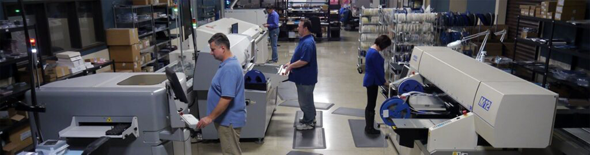

## You're DUE for something NEW!

Physical computing was never easier, thanks to DUE. Developer can now read sensors and control motors right from their favorite programming languages.

DUE is a Dynamic, Universal, and Extensible platform that links devices to the physical world. These devices can be desktops, laptops, phones, or even a Raspberry PI. Developers have the option to use any modern operating system and use the programming language of their choice.

---
## Code in the language you choose!

Developers have the choice to use any development environment and IDE they choose.  Additionally, any modern operating system or language can be used. Some languages are supported out-of-the-box and others can be added easily.

---
## Start Immediately using the DUE Console

The DUE Link platform includes a scripting language called [DUE Script](~/software/due-script/due-script.md) it run internally on any [DUE-enabled hardware](~/hardware/intro.md). This allows the device to run standalone independent from any host. This very easy-to-learn scripting language is inspired by BASIC and Python, giving the user the simplicity and flexibility they need.

The on-line DUE Console lets developers start experimenting with DUE Script and the physical world in minutes...no installation is necessary!

---
## Hardware options

The power of DUE is available on Fast-and-Easy (FEZ) maker-friendly boards FEZ Flea and FEZ Pico. Educators now have the power to use their beloved language-of-choice with BrainPad devices.

---
## Continuous Innovation

[GHI Electronics](https://www.ghielectronics.com/)  has been bridging the hardware-to-software gap since 2003 with modern platforms,devices,systems, and coding languages. [GHI Electronics](https://www.ghielectronics.com/)  is yet again bringing you an new innovation to make physical computing accessible to everyone. Not just the hardware developer.

> [!Video https://www.youtube.com/embed/ojJmKfdOpAI]

