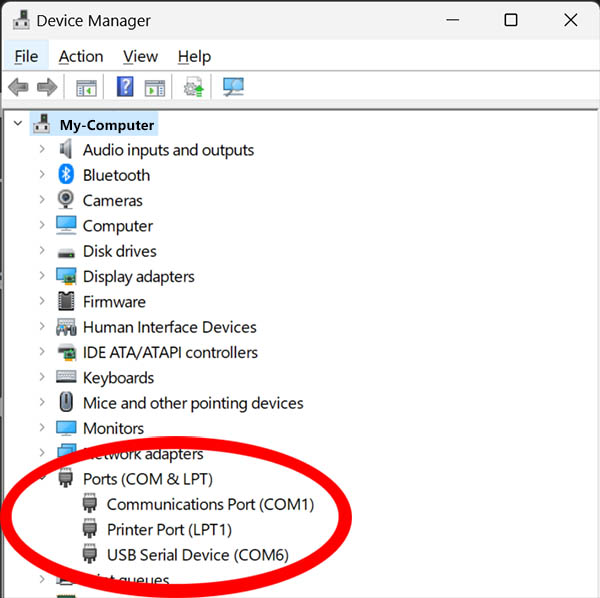

# Coding Options

---

The DUE Link Platform ships with multiple supported languages. Users interested in supporting other languages can convert one of the open-source libraries (such as Python) to their language of choice.

Developers have the choice to use any development environment and IDE of choice. Additionally, any modern operating system or language can be used. Some languages are supported out-of-the-box and others can be added.

> [!NOTE]
> This section talks about supported languages running on a host (computer, table, phone...etc.). DUE Platform also includes [DUE Script](../due-script/due-script.md) allowing a DUE-enabled hardware to run independently.

## Open Source

Libraries for the supported languages are provided open-source. We invite you to learn more about the internal workings of DUE Link and also invite you to support additional systems and languages. [DUE Libraries Repo](https://github.com/ghi-electronics/due-libraries).

## The Transport

The host connects to a due device using a standard USB connection. All the necessary USB descriptors are built in a standard manner that no drivers are necessary. Once a device is plugged in, the host (computer, phone, Windows, Android, Mac...etc.) will detect and enable a new serial port. The library will then use this serial port to communicate with the DUE-enabled device.

On Windows, the device manager can be used to see a list of available serial ports.

## Troubleshooting

The DUE console is the perfect place to connect and verify functionality.

The first thing to do when facing any troubles is making sure the device is loaded with the latest firmware. The instructions are found on the device's [Hardware](../../hardware/intro.md) page.

Next, verify that you have the latest library. Visit the [Downloads](../downloads.md) page to download the latest library.

 