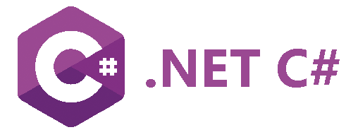

# .NET

---



The .NET DUE library allows full .NET programs to access physical sensors and actuators. This allows complex .NET programs to do all the heavy lifting and send only the necessary components to control devices.

The provided library is implemented in C# but the user can use any .NET system, such as **Visual Basic**.

## Setup
This page assumes the user is already familiar with .NET C# and there is a development machine that is already setup to build and run .NET programs. No changes are needed there but we are using Microsoft Visual Studio Code as a personal preference.

> [!TIP]
> If this is the first time you use your device, start by visiting the [Hardware](../../hardware/intro.md) page and load your device with the appropriate firmware. The [Console](../console.md) is also a great place to start.

Start a new project with a simple line of code to test out the project is running

> [!TIP]
> C# Top level statements feature is being utilized, but not required.

```csharp
Console.WriteLine("Hello, World!");
```
Download and install the latest `GHIElectronics.DUELink` library from NuGet.org. Alternatively, get it from the [Downloads](../downloads.md) page.

## Blinky!
Our first program will blink the on-board LED 20 times, where it comes on for 200ms and then it is off for 800ms.

> [!NOTE]
> We can access which COM port our DUE enable device is connected to by calling the GetConnectionPort()

```csharp
using GHIElectronics.DUELink;
Console.WriteLine("Hello DUE!");
var availablePort = DUELinkController.GetConnectionPort();
var dev = new DUELinkController(availablePort);
dev.Led.Set(200, 800, 20);
Console.WriteLine("Bye DUE!");
```

## .NET API

The provided API mirrors DUE Script's [Core library](../due-script/corelib/corelib.md). Referencing those APIs is a good place to learn about the available functionality and available arguments.

| .NET API                   | DUE Script Equivalent										|Description
| :---                         |:---													|
| Analog.Read()                |[ARead()](../due-script/corelib/analog.md)				| Reads analog pin
| Analog.Write()               |[AWrite()](../due-script/corelib/analog.md)				| Reads analog pin
| Button.Enable()              |[BtnEnable()](../due-script/corelib/button.md)			| Sets up a button to be used
| Button.JustPressed()         |[BtnDown()](../due-script/corelib/button.md)			| Detects if button was pressed 
| Button.JustReleased()        |[BtnDown()](../due-script/corelib/button.md)			| Detects if button is released 
| DeviceConfig.IsEdge()        |[Version()](../due-script/corelib/systemfunctions.md)	| Checks for specific hardware
| DeviceConfig.IsFlea()        |[Version()](../due-script/corelib/systemfunctions.md)	| Checks for specific hardware
| DeviceConfig.IsPico()        |[Version()](../due-script/corelib/systemfunctions.md)	| Checks for specific hardware
| DeviceConfig.IsPulse()       |[Version()](../due-script/corelib/systemfunctions.md)	| Checks for specific hardware
| DeviceConfig.MaxPinIO()      |NA														| Returns # available GPIOs
| DeviceConfig.MaxPinAnalog()  |NA														| Returns # available Analog pins
| Digital.Read()               |[DRead()](../due-script/corelib/digital.md)				| Reads digital pin
| Digital.Write()              |[DWrite()](../due-script/corelib/digital.md)			| Writes to digital pin
| Display.Clear()              |[LcdClear()](../due-script/corelib/lcd.md)				| Clears the display black or white
| Display.Configuration()      |[LcdConfig()](../due-script/corelib/lcd.md)				| Set display configuration 
| Display.DrawBuffer()         |[LcdStream()](../due-script/corelib/lcd.md)				| Updates the entire display, takes an array, using stream, with automatic Show()
| Display.DrawBufferBytes()    |[LcdStream()](../due-script/corelib/lcd.md)				| Updates the entire display, takes bytes, using stream, with automatic Show()
| Display.DrawCircle()         |[LcdCircle()](../due-script/corelib/lcd.md)				| Draws a circle on the display
| Display.DrawFillRect()       |[LcdFill()](../due-script/corelib/lcd.md)				| Draws a filled rectangle on the display
| Display.DrawImage()          |[LcdImg()](../due-script/corelib/lcd.md)				| Draws an image using an array
| Display.DrawImageBytes()     |[LcdImg()](../due-script/corelib/lcd.md)				| Draws an image using bytes
| Display.DrawImageScale()     |[LcdImg()](../due-script/corelib/lcd.md)				| Works same as DrawImage() adds scaling
| Display.DrawLine()           |[LcdLine()](../due-script/corelib/lcd.md)				| Draws a line on the display
| Display.DrawRectangle()      |[LcdRect()](../due-script/corelib/lcd.md)			    | Draws a rectangle on the display
| Display.DrawText()           |[LcdText()](../due-script/corelib/lcd.md)				| Draws a text on the display
| Display.DrawTextScale()      |[LcdTextS()](../due-script/corelib/lcd.md)				| Draws scaled text on the display
| Display.SetPixel()           |[LcdPixel()](../due-script/corelib/lcd.md)				| Draws pixel on the display
| Display.Show()               |[LcdShow()](../due-script/corelib/lcd.md)				| Sends the display buffer
| Distance.Read()              |[Distance()](../due-script/corelib/distance.md)			| Used to read distance sensors
| Frequency.Write()            |[Freq()](../due-script/corelib/frequency.md)			| Hardware generated PWM signal
| I2c.Write()				   |[I2cStream()](../due-script/corelib/i2c.md)				| I2C write, using stream
| I2c.Read()				   |[I2cStream()](../due-script/corelib/i2c.md)				| I2C read, using stream
| I2c.WriteRead()			   |[I2cStream()](../due-script/corelib/i2c.md)				| I2C write/read, using stream
| Infrared.Enable()			   |[IrEnable()](../due-script/corelib/infrared.md)			| Enables pin for IR signal capture
| Infrared.Read()			   |[IrRead()](../due-script/corelib/infrared.md)			| Reads value from IR enabled pin
| Led.Set()	   	         	   |[LED()](../due-script/corelib/led.md)					| Controls the on-board LED
| Neo.Clear()	   	           |[NeoClear()](../due-script/corelib/neopixel.md)			| Clears all LED's in memory
| Neo.SetColor()	           |[NeoSet()](../due-script/corelib/neopixel.md)			| Set's a specific LED to a color
| Neo.Show()	   	           |[NeoShow()](../due-script/corelib/neopixel.md)			| Transfers the internal pattern to LEDs
| Neo.SetMultiple()            |[NeoStream()](../due-script/corelib/neopixel.md)		| Updates all LEDs, using streams, with automatic `Show()`
| Led.Set()	   	         	   |[LED()](../due-script/corelib/led.md)					| Controls the on-board LED
| Servo.Set()	   	           |[ServoSet()](../due-script/corelib/servo.md)			| Sets servo motor connected to a pin
| Spi.Configuration()	   	   |[SpiCfg()](../due-script/corelib/spi.md)				| Configures SPI bus
| Spi.Palette()	   	           |[Palette()](../due-script/corelib/spi.md)				| Sets the desired color for a palette
| Spi.Read()	   	           |[SpiByte()](../due-script/corelib/spi.md)				| Reads SPI byte
| Spi.Write()	   	           |[SpiByte()](../due-script/corelib/spi.md)				| Sends SPI byte
| Spi.Write4bpp()	   	       |[Spi4Bpp()](../due-script/corelib/spi.md)			    | Streams and converts data from 4BPP to 16BPP
| Spi.WriteRead()	   	       |[SpiStream()](../due-script/corelib/spi.md)				| Write & Read SPI bytes
| System.Beep()	   	           |[Beep()](../due-script/corelib/beep.md)					| Uses any pin to generate a tone
| System.GetTickMicroseconds() |[TickUs()](../due-script/corelib/systemfunctions.md)	| Returns system time in microseconds
| System.GetTickMilliseconds() |[TickMs()](../due-script/corelib/systemfunctions.md)	| Returns system time in milliseconds
| System.Print()	           |[Print()](../due-script/corelib/systemfunctions.md)		| Print to LCD display and Debug Output on the same line
| System.PrintLn()	           |[PrintLn()](../due-script/corelib/systemfunctions.md)	| Print to LCD display and Debug Output then moves to next line
| System.Reset()	           |[Reset()](../due-script/corelib/systemfunctions.md)		| Resets the board
| System.Wait()	               |[Wait()](../due-script/corelib/systemfunctions.md)		| Pause the system in milliseconds
| Touch.Read()	               |[TouchRead()](../due-script/corelib/touch.md)           | Initialize a pin for touch
| Uart.BytesToRead()	       |[UartCount()](../due-script/corelib/uart.md)			| How many bytes buffered and ready to read
| Uart.Enable()	               |[UartInit()](../due-script/corelib/uart.md)				| Initialize UART
| Uart.Read()	               |[UartRead()](../due-script/corelib/uart.md)				| Read UART data
| Uart.Write()	               |[UartWrite()](../due-script/corelib/uart.md)			| Write UART data
| Version()					   |[Version()](../due-script/corelib/systemfunctions.md)	| Returns the current DUE firmware version

> [!NOTE]
> For convenience, the Pin Enum includes, ButtonA, ButtonB and Led. For example: `dev.Digital.Write(dev.Pin.Led, True)`


## DUE Script Control

These methods allow developers to control DUE Scripts right from within .NET

| Method                       | Description                                        |
| :---                         |:---                                                |
| Script.Execute()	   	       | Executes the single line of code immediately       |
| Script.IsRunning()	   	   | Checks if DUE Script is running                    |
| Script.Load()	   	           | Loads the line into internal buffer                |
| Script.New()	   	           | Clears the program stored in flash                 |
| Script.Read()	   	           | Read the program stored in flash and return as string |
| Script.Record()	   	       | Sends the internal buffer to the device, overwriting any previous programs |
| Script.Run()	   	           | Runs the program stored in flash                   |

This example will load a simple program line by line and then record it.

```csharp
dev.Script.Load("c = 10");
dev.Script.Load("@Blink");
dev.Script.Load("Led(100,100,c)");
dev.Script.Record();
```

This is an example to execute a single line(immediate mode). This does not modify the application stored in flash. 

```csharp
dev.Script.Execute("LED(200,200,10)");
```

You can also access a previously recorder program using goto (to label) or by calling a function that has a return. This example calls the recorded program above.

```csharp
dev.Script.Execute("c=5:goto Blink");
```

