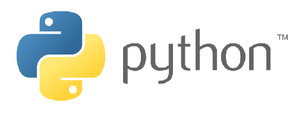

# Python

---



The Python DUE library allows for the use of full standard Python to access physical-computing.

## Setup
This page assumes the user is already familiar with Python and there is a development machine that is already setup to build and run Python programs. No changes are needed there but we are using Microsoft Visual Studio Code as a personal preference.

> [!TIP]
> If this is the first time you use your device, start by visiting the [Hardware](../../hardware/intro.md) page and load your device with the appropriate firmware. The [Console](../console.md) is also a great place to start.

Start a new project with a simple line of code to test out the project is running

```py
print("Hello DUE!")
```

Go to the [Downloads](../downloads.md) page and download the latest Python library. Install the library on your system using `pip install Due-0.0.1-py3-none-any.whl`

If you do not have the pyserial already installed, then also run `pip install pyserial`.

## Blinky!
Our first program will blink the on-board LED 20 times, where it comes on for 200ms and then it is off for 800ms.

> [!NOTE]
> Change the serial port number to match your port and th system you are using.

```py
from Due.DueController import DueController
print("Hello DUE!")
dev = DueController("COM27")
# Flash the LED 20 times (on for 200ms and off for 800ms)
dev.Led.Set(200,800,20)
print("Bye DUE!")
```

## Python API

The provided API mirrors DUE Script [Core library](../due-script/corelib/corelib.md). Referencing those APIs is a good place to learn about the available functionality.
