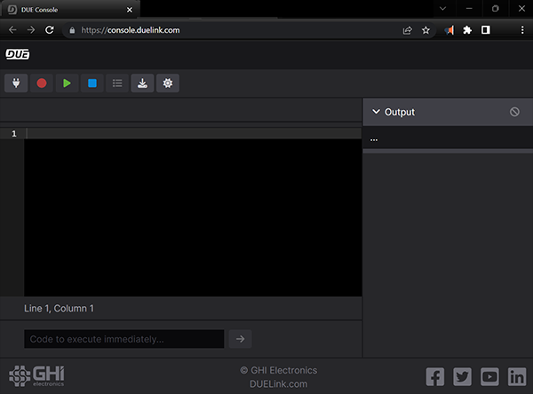
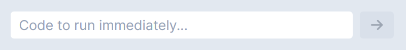
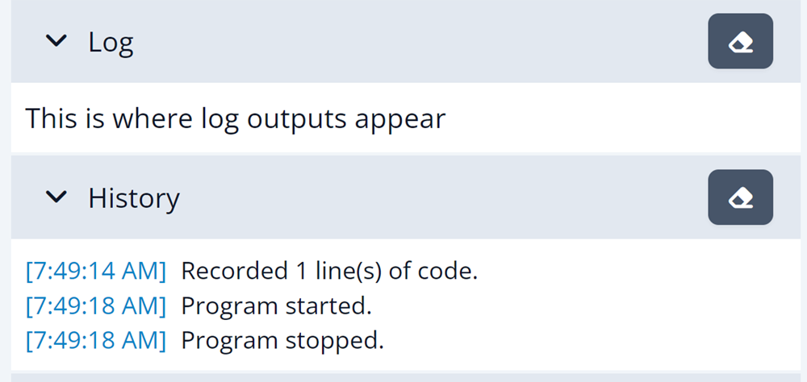
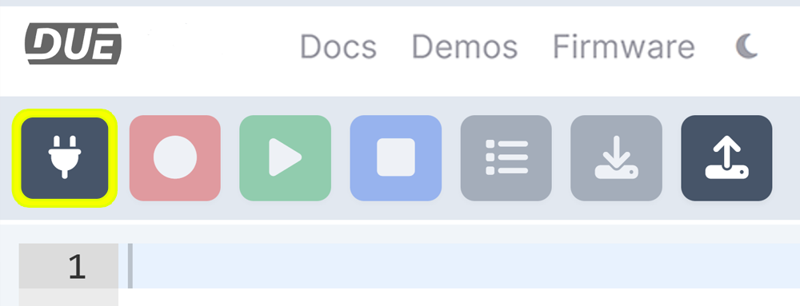
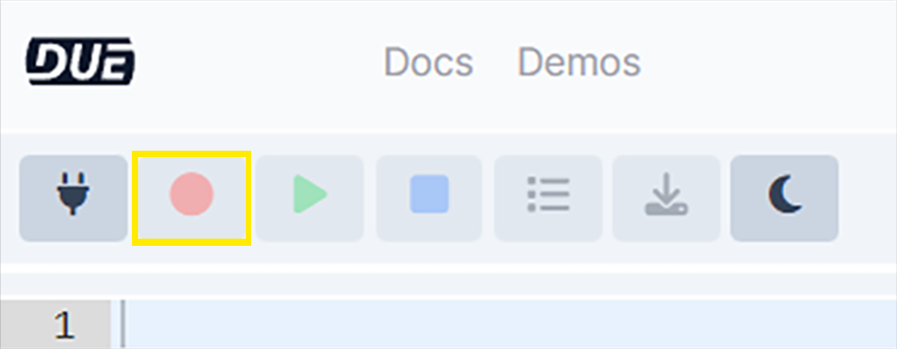
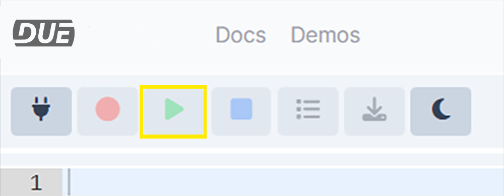
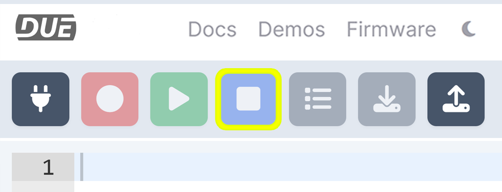
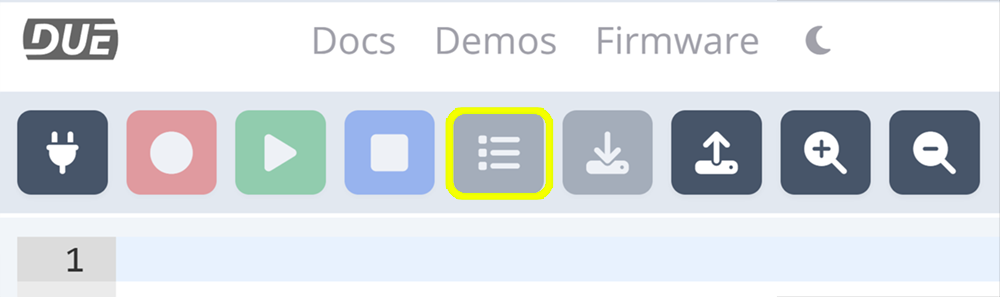
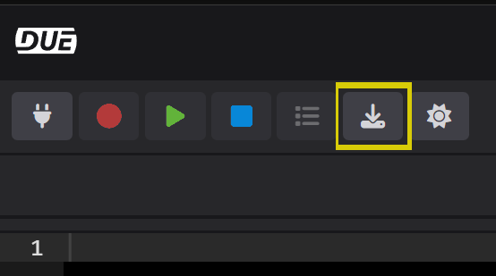

# DUE Console

---

The DUE Console provides many functionalities. It is a great start to verify the device is functioning properly. It is also a great place to learn about and use [DUE Scripts](due-script/due-script.md) and take advantage of the versatile [DUE core libraries](due-script/corelib/corelib.md)

[**console.duelink.com**](https://console.duelink.com/)

 

---

## Immediate Window

The immediate text box sends and runs the code immediately on the DUE hardware as soon as the `send` arrow is pressed. 

 

Try `DWrite('L',1)` to run the LED on and then `DWrite('L',0)` to turn it off.

---

---
## Output window

The DUE Output window is where DUE hardware will talk back to the console. The `button` clears the Output window. 

 

---

## Connect

Select the connect button to connect to the DUE hardware.

 

---

## Record

Sends the script to the DUE hardware's flash. 

 

---

## Play

Runs the code that is stored in flash. 

 

---

## Stop

Stops the program running on the DUE hardware.

 

---

## List

List's the program current stored in flash on the console's output window.

 

---

## Download

Saves the code in the console.s window to a text file. 

 

---

## Theme

Changes the consoles theme to Light or Dark. 

 

---