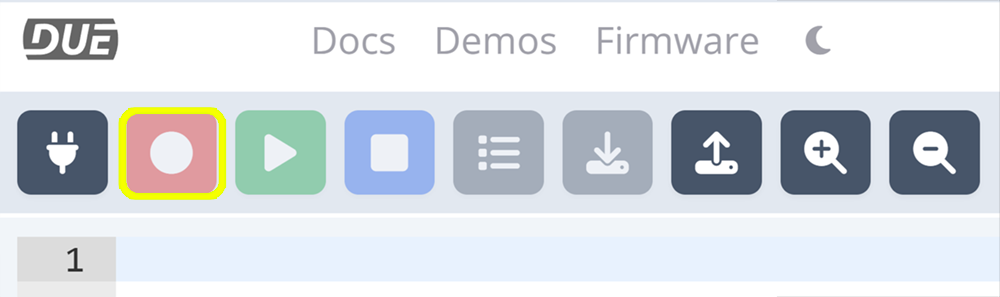

# DUE Console

---

The DUE Console provides many functionalities. It is a great start to verify the device is functioning properly. It is also a great place to learn about and use [DUE Scripts](due-script/due-script.md).

[https://console.duelink.com/](https://console.duelink.com/)

 

---
## Output window

The DUE Output window is where DUE hardware will talk back to the console. The `clear` button clears the Output window. 

 

## Connect

Select the connect button to connect to the DUE hardware.

 

---

## Record

Sends the script to the DUE hardware's flash. 

 

---

## Play

Runs the code that is stored in flash. 

 

---

## Stop

Stops the program running on the DUE hardware.

 

---

## List

List's the program current stored in flash on the console's output window.

 

---

## Download

Saves the code in the console.s window to a text file. 

 

---

## Theme

Changes the consoles theme to Light or Dark. 

 

---