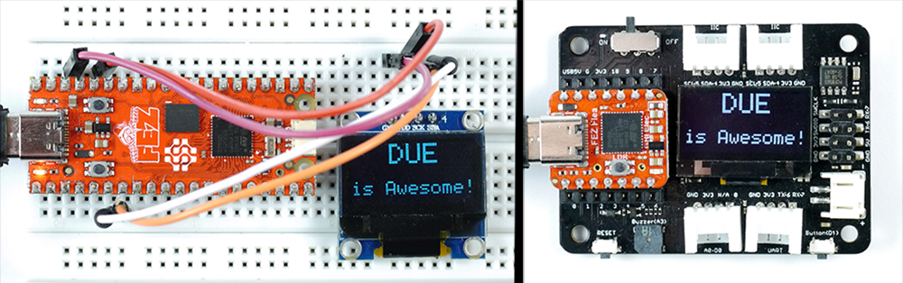
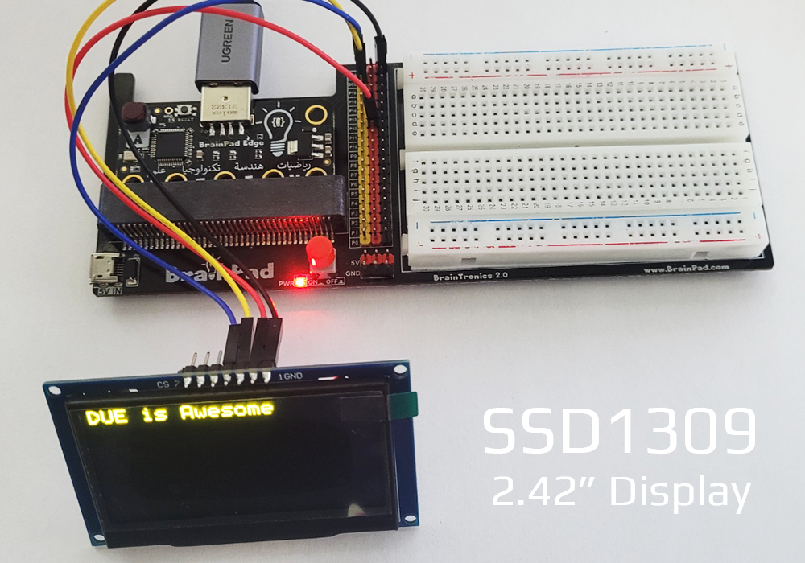

## LCD
These functions allow for simple graphics on the very common I2C displays that use the SSD1306 controller and have 128x64 pixels. This display is found on the BrainPad Pulse by default, and can be added to the I2C channel on all of the other boards. These displays are available in multiple sizes but most common is 0.96".



> [!Tip]
> We have tested 2.42" displays that use SSD1309 and seemed to work perfectly.



> [!Caution]
> Displays with knock-off controller SSH1106 that is supposed to be compatible with SSD1306 did not work as expected.

- **LcdConfig(output,address)** Pipes the graphics to a connected display. <br>
By default, all graphics is directed to the display found on BrainPad Pulse. However, making a call to `LcdConfig()` directs the system to send all graphics to an external display, at the provided `address`. Setting the address to `0` resets the configuration to the default BrainPad Pulse LCD<br>
**output:** Output to display , 0 = none, 1 = console, 2 = LCD & console <br>
**address:** I2C address, 0 = default(BrainPad Pulse)

> [!Tip]
> This function is not needed to use the display found on BrainPad Pulse.

This example will pipe (direct) graphics to an external 2.42" display with address 0x??, wired to ?product name???. Tip: A resistor on the back of the display needs to be moved to change its bus from SPI to I2C.

image

```basic
LcdConfig(0x12)
LcdClear(0)
LcdText("Hello World",1,10,10)
LcdShow()
```

- **LcdShow()** Sends the display buffer to the LCD. 

- **LcdClear(color)**  Clears the entire screen to black or white<br>
**color:** 0 = black, 1 = white

```basic
LcdClear(0)
LcdShow()
```

**Draw Line**

- **LcdLine(color, x1,y1,x2,y2)** <br>
**color:** 0 = black, 1 = white <br>
**x1:** Starting x point <br>
**y1:** Starting y point <br>
**x1:** Ending x point <br>
**y1:** Ending y point 

```basic
LcdClear(0)
LcdLine(1,0,0,128,64)
LcdShow()
```

**Set Pixel**

- **LcdPixel(color, x, y)** <br>
**color:** 0 = black, 1 = white <br>
**x:** x pixel value<br>
**y:** y pixel value

```basic
LcdClear(0)
LcdPixel(1,64,32)
LcdShow()
```

**Draw Circle**

- **LcdCircle(color, x,y,radius)** <br>
**color:** 0 = black, 1 = white <br>
**x:** x position of circle's center <br>
**y:** y position of circle's center <br>
**radius:** radius of the circle

```basic
LcdClear(0)
LcdCircle(1,64,32,31)
LcdShow()
```

**Draw Rectangle**

- **LcdRect(color, x, y, width, height)** <br>
**color:** 0 = black, 1 = white <br>
**x:** Starting x point <br>
**y:** Starting y point <br>
**width:** Rectangle width <br>
**height:** Rectangle height 

```basic
LcdClear(0)
LcdRect(1,10,10,118,54)
LcdShow()
```

**Filled Rectangle**

- **LcdFill(color, x, y, width, height)** <br>
**color:** 0 = black, 1 = white <br>
**x:** Starting x point <br>
**y:** Starting y point <br>
**width:** Rectangle width <br>
**height:** Rectangle height 

```basic
LcdClear(0)
LcdFill(1,10,10,118,54)
LcdShow()
```

**Draw Scaled Text**

- **LcdTextS("text", color, x, y, scaleWidth, scaleHeight)** <br>
**text:** String message in double quotes. <br>
**Str():** is used to convert variables to strings <br>
**color:** 0 = black, 1 = white <br>
**x:** x position <br>
**y:** x position <br>
**scaleWidth:** Width scale multiplier <br>
**scaleHeight:** Width scale multiplier 

```basic
LcdClear(0)
LcdTextS("Hello",1,0,0,2,2)
LcdShow()
Wait(1000)
x=100
LcdClear(0)
LcdTextS(Str(x),1,0,0,2,2)
LcdShow()
```

> [!TIP]
> Scale is multiplier for the pixel in width and height to make the font larger

**Draw Text**

- **LcdText("text", color, x, y)** <br>
Works exactly the same as **LcdText()** minus scaling.

```basic
LcdClear(0)
LcdText("Hello World",1,10,10)
LcdShow()
x=100
LcdClear(0)
LcdText(str(x),1,0,0)
LcdShow()
```

**LCD Stream**

Stream is used to send the entire LCD update. 

> [!NOTE] 
> Streams are not coded directly using DUE Script, see [Streams](../streams.md)

- **LcdStream()**<br>
 **Stream Size:** The size screen size divided by 8, 128x64/8=1K.
The data is organized as 8bit columns going left to right and then wrapping around to the next row.

Example code to set a pixel at 10x10

```cs
int x=10;
int y=10;

buffer[(y >> 3) * 128 + x] |= (byte)(1 << (y & 7));
```
> [!NOTE]
> LCD Stream automatically calls `LcdShow()` internally.


