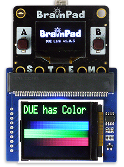

# LCD
These functions allow for graphics on multiple display types, including B&W and color display.

## B&W Displays

LCD Graphics supports SSD1306 128x64 B&W I2C, which work on all BrainPad boards. This display is found on the BrainPad Pulse by default, and can be added to the I2C channel on all of the other boards. These displays are available in multiple sizes but most common is 0.96". The `LcdConfig()` function (documented below) can be used to configure the system to work with an externally connected display.


> [!Tip]
> We have tested 2.42" displays that use SSD1309 and seemed to work perfectly.


> [!Caution]
> Displays with knock-off controller SSH1106 that is supposed to be compatible with SSD1306 did not work as expected.

## Color Displays


Support for color displays includes ILI9342, ILI9341, and ST7735. These color displays only work on boards with SC13 chipset.
 The `LcdConfig()` function (documented below) can be used to configure the system to work with an externally connected display.


## Display Configuration

- **LcdConfig(address, config, cs, dc)** Configures a connected display. <br>
**address:** Display's address or type. 0 = on-board display.<br>
**config:** external LCD configuration.<br>
**cs:** Chip select pin. <br>
**dc:** Data control pin. <br>

> [!Tip]
> This function is not needed to use the on-board display.

**address:** For I2C displays: This is the 7-bit I2C device's address of the connected SSD1306 display. All other arguments are ignored. For SPI displays: This is the SPI display's type 0x08: ILI9342, 0x81: ILI9341, 0x82: ST7735.

**config:** these values can be added together to make up the desired configuration.

| value (bits) | Function | Value |
| - | - | - |
| 1 (bit0) | Orientation | 0: Landscape, 1: Portrait |
| 2 (bit1) | Flip Horizontal | 0: None, 1: Flip |
| 4 (bit2) | Flip Vertical | 0: None, 1: Flip |
| 8 (bit3) | RGB | 0: None, 1: BGR |
| 16 (bit4) | Swap Byte Endianness | 0: None, 1: Swap |
| 32 (bit5) | Reserved |  |
| 64 (bit6) | Reserved |  |
| 128 (bit7) | Reserved |  |
| bits[8..11] | Window x | Special config |
| bits[12..15] | Window y | Special config |

**cs:** The pin connected to the display's Chip select signal.

**dc:** The pin connected to the display's Data Control signal.


This example will set the system to use the color display adapter from Waveshare, which uses ST7735 1.8" display. The display's chip select is on pin 16 and data control is on pin 12. There is also a backlight on pin 1 and reset on pin 8 that need to be controlled manually.

The display on adapter needs to be flipped horizontally (config value 2) and also requires this value added, 0x2100. This sets the drawing window.

<!--
<p align="center">
-->



```basic
DWrite(1,1)#turn on the back-light
DWrite(8,1)# release reset 

LcdConfig (0x82,2+0x2100,16,12)
LcdClear(0)
LcdTextS("DUE has Color",0x00FF00,0,0,2,3)

for c in range(2,200)
    LcdLine(c,c,40,c,60)
    LcdLine(c<<8,200-c,60,200-c,80)
    LcdLine(c<<16,c,80,c,100)
next

LCDShow() 
```

To set the display to portrait mode, change the config line to `LcdConfig (0x82, 1+0x2100, 16, 12)`. Flip is not needed in this case.


This example below will direct graphics to an external 2.42" display with address 0x3C, wired to the 2.42" SSD1309 display showing in the image above. Tip: A resistor on the back of the display needs to be moved to change its bus from SPI to I2C.

```basic
LcdConfig(0x3C,0,0,0)
LcdClear(0)
LcdText("Hello World",1,10,10)
LcdShow()
```

---

## Graphical Memory

All LCD functions process the graphics commands in an internal memory. It starts with LcdClear(), which clears up the entire graphics memory to a specific color. When the user is ready, the graphical memory is transferred to the display using LcdShow().

- **LcdShow()** Sends the display buffer to the LCD. 

- **LcdClear(color)**  Clears the entire screen to black or white<br>
**color:** Color value

```basic
LcdClear(0)
LcdShow()
```

## Color Value

The system supports Color and B&W displays. To keep uniformity, 0 is always black and 1 is always white. Any other value is considered a standard RGB color formatted 0xRRGGBB. For example, GHI Electronics blue is 0x0977aa.

## Draw Line

- **LcdLine(color, x1,y1,x2,y2)** <br>
**color:** Color value <br>
**x1:** Starting x point <br>
**y1:** Starting y point <br>
**x2:** Ending x point <br>
**y2:** Ending y point 

```basic
LcdClear(0)
LcdLine(1,0,0,128,64)
LcdShow()
```

## Set Pixel

- **LcdPixel(color, x, y)** <br>
**color:** Color value <br>
**x:** x pixel value<br>
**y:** y pixel value

```basic
LcdClear(0)
LcdPixel(1,64,32)
LcdShow()
```

## Draw Circle

- **LcdCircle(color, x,y,radius)** <br>
**color:** Color value <br>
**x:** x position of circle's center <br>
**y:** y position of circle's center <br>
**radius:** radius of the circle

```basic
LcdClear(0)
LcdCircle(1,64,32,31)
LcdShow()
```

## Draw Rectangle

- **LcdRect(color, x, y, width, height)** <br>
**color:** Color value <br>
**x:** Starting x point <br>
**y:** Starting y point <br>
**width:** Rectangle width <br>
**height:** Rectangle height 

```basic
LcdClear(0)
LcdRect(1,10,10,118,54)
LcdShow()
```

## Draw Filled Rectangle

- **LcdFill(color, x, y, width, height)** <br>
**color:** Color value <br>
**x:** Starting x point <br>
**y:** Starting y point <br>
**width:** Rectangle width <br>
**height:** Rectangle height 

```basic
LcdClear(0)
LcdFill(1,10,10,118,54)
LcdShow()
```

## Draw Text

- **LcdText("text", color, x, y)** <br>
**text:** String message in double quotes. <br>
**Str():** is used to convert variables to strings <br>
**color:** Color value <br>
**x:** x position <br>
**y:** x position <br>

```basic
LcdClear(0)
LcdText("Hello World",1,10,10)
LcdShow()
x=100
LcdClear(0)
LcdText(Str(x),1,0,0)
LcdShow
```

## Draw Scaled Text

Works exactly the same as **LcdText()** but adds scaling.

- **LcdTextS("text", color, x, y, scaleWidth, scaleHeight)** <br>
**text:** String message in double quotes. <br>
**Str():** is used to convert variables to strings <br>
**color:** Color value <br>
**x:** x position <br>
**y:** x position <br>
**scaleWidth:** Width scale multiplier <br>
**scaleHeight:** Height scale multiplier 

```basic
LcdClear(0)
LcdTextS("Hello",1,0,0,2,2)
LcdShow()
Wait(1000)
x=100
LcdClear(0)
LcdTextS(Str(x),1,0,0,2,2)
LcdShow()
```

> [!TIP]
> Scale is multiplier for the pixel in width and height to make the font larger
()

## Draw Image

- **LcdImg(array, x, y, transform)**<br>
**array:** Image array (see below). <br>
**x:** x position on screen. <br>
**y:** y position on screen. <br>
**transform:** transform modifier. <br>

There are cases where images need to be added to the screen. Of course, we are taking about basic simple images, more like a tiny sprite in a game. 

The image is an array of pixels. This arrays must start with 2 elements that contain the image's width and height. We will place the array on multi line to help us visualize what the image might look like, but placing everything on a single line has the same effect

Image Array formatting:

```basic
Dim a[2+(8*8)] = [8,8,
0, 0, 0, 1, 1, 0, 0, 0,
0, 0, 1, 1, 1, 1, 0, 0,
0, 1, 1, 1, 1, 1, 1, 0,
1, 1, 0, 1, 1, 0, 1, 1,
1, 1, 1, 1, 1, 1, 1, 1,
0, 0, 1, 0, 0, 1, 0, 0,
0, 1, 0, 1, 1, 0, 1, 0,
1, 0, 1, 0, 0, 1, 0, 1]
```

The following example displays the image array on the screen. 

```basic
Dim a[2+(8*8)] = [8,8,
0, 0, 0, 1, 1, 0, 0, 0,
0, 0, 1, 1, 1, 1, 0, 0,
0, 1, 1, 1, 1, 1, 1, 0,
1, 1, 0, 1, 1, 0, 1, 1,
1, 1, 1, 1, 1, 1, 1, 1,
0, 0, 1, 0, 0, 1, 0, 0,
0, 1, 0, 1, 1, 0, 1, 0,
1, 0, 1, 0, 0, 1, 0, 1]
LcdClear(0)
LcdImg(a,60,30,0)
LcdShow()
```

Transformation modifiers:


| Value  | Transformation										
| :---   |:---													
| 0      |No transform	
| 1      |Flip image horizontally
| 2      |Flip image vertically
| 3      |Rotate image 90 degrees
| 4      |Rotate image 180 degrees
| 5      |Rotate the image 270 degrees(same as -90 degrees)	


## Draw Scaled Image

Works the same as `LcdImg()` but adds scaling. 

- **LcdImgS(array, x, y, scaleWidth, scaleHeight, transform)**<br>
**array:** Image array (see below). <br>
**x:** x position on screen. <br>
**y:** y position on screen. <br>
**scaleWidth:** Width scale multiplier <br>
**scaleHeight:** Height scale multiplier <br>
**transform:** transform modifier. (see above)

## LCD Stream

Stream is used to send the entire LCD update. 

> [!NOTE] 
> Streams are not coded directly using DUE Script, see [Streams](../streams.md)

- **LcdStream(colorDepth)**<br>
**ColorDepth:** This lets the stream know what is the format of the incoming data stream. B&W displays only support 1. Color displays support 4 (palette), 8, and 16 bits.

The command is followed by the data [stream](../streams.md). The stream size is determined by the used screen size and the color depth. For example, Pulse uses a 128x64 display with 1bpp. This results in 128x64/8 = 1KBytes.

> [!TIP] 
> On 1bpp display, the data is organized as 8bit columns going left to right and then wrapping around to the next row.

## Palette

- **Palette(index, colorValue)** - Sets the desired color for a palette.<br>
**index:** Index number of color<br>
**colorValue:** A standard HEX value of the RGB color. 

The palette is used when 4bpp color depth is used with streams. The palette table is used as a lookup table to set the color for each one of the 16 possibilities. The default colors are below; however, the user can change it to whatever they desire. For example, they can be set to 16 shades of green to show a forest scene that needs different shades of green. 

Default colors:

|Index|Color Value|Color|
|:-   |:-------|:----------|
|0    |0x000000|Black      |
|1    |0xFFFFFF|White      |
|2    |0xFF0000|Red        |
|3    |0x32CD32|Lime       |
|4    |0x0000FF|Blue       |
|5    |0xFFFF00|Yellow     |
|6    |0x00FFFF|Cyan       |
|7    |0xFF00FF|Magenta    |
|8    |0xC0C0C0|Silver     |
|9    |0x808080|Gray       |
|10   |0x800000|Maroon     |
|11   |0xBAB86C|Olive      |
|12   |0x00FF00|Green      |
|13   |0xA020F0|Purple     |
|14   |0x008080|Teal       |
|15   |0x000080|Navy       | 


Example code to set a pixel at 10x10

```cs
int x=10;
int y=10;

buffer[(y >> 3) * 128 + x] |= (byte)(1 << (y & 7));
```
> [!NOTE]
> LCD Stream automatically calls `LcdShow()` internally.


